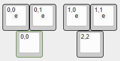
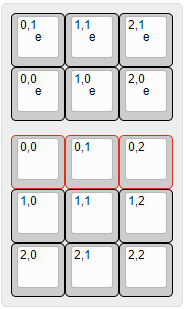

# Rotary encoders

Vial implements optional GUI configuration for rotary encoders. This allows users to set up separate keycode actions for clockwise and counterclockwise encoder rotations. Encoders fully support QMK layers, so different keycodes can be used for different layers.

You will need to port your keyboard over to Vial before encoders are supported. Follow [Step 1](/porting-to-via.md) and [Step 2](/porting-to-vial.md) to get started.

In order to enable encoder support in your firmware, follow these steps:

## 1. Add basic QMK support for encoders

Add this to your main `rules.mk`:

```make
ENCODER_ENABLE = yes
```
or in `info.json`:
```json
{
  "features": {
    "encoder": true
  }
}
```
Configure the encoder pins in `config.h`:

```c
//1 Encoder
#define ENCODERS_PAD { encoderA, encoderB }

//2 or more encoders
#define ENCODERS_PAD_A { encoder1a, encoder2a }
#define ENCODERS_PAD_B { encoder1b, encoder2b }
```
or more preferably with `info.json`:
```json
{
  "encoder": {
    "rotary": [
      { "pin_a": "B0", "pin_b": "C14", "resolution": 4 },
      { "pin_a": "B1", "pin_b": "C15", "resolution": 4 }
    ]
  }
}
```
Further advanced options follows QMK's rules for encoders, refer to [QMK documentation](https://docs.qmk.fm/#/feature_encoders?id=encoders) in order to configure encoders fully.

##### If working from an existing QMK firmware with working encoders, this step can likely be skipped.

## 2. Enable QMK Encoder Map

Add this to the `rules.mk` file in the Vial keymap folder:
## Warning! 
This rule should only be done at the keymap level, not at the keyboard level
```make
ENCODER_MAP_ENABLE = yes
```
Add this to the `keymap.c` in the Vial keymap folder (example of two encoders, four layers):
```c
#if defined(ENCODER_MAP_ENABLE)
const uint16_t PROGMEM encoder_map[][NUM_ENCODERS][2] = {
    [0] =   { ENCODER_CCW_CW(KC_MS_WH_UP, KC_MS_WH_DOWN), ENCODER_CCW_CW(KC_VOLD, KC_VOLU)  },
    [1] =   { ENCODER_CCW_CW(RGB_HUD, RGB_HUI),           ENCODER_CCW_CW(RGB_SAD, RGB_SAI)  },
    [2] =   { ENCODER_CCW_CW(RGB_VAD, RGB_VAI),           ENCODER_CCW_CW(RGB_SPD, RGB_SPI)  },
    [3] =   { ENCODER_CCW_CW(RGB_RMOD, RGB_MOD),          ENCODER_CCW_CW(KC_RIGHT, KC_LEFT) },
    //                  Encoder 1                                     Encoder 2
};
#endif
```
**Important!** The encoder map needs to have the same number of layers as your main keymap.

Refer to [QMK documentation](https://docs.qmk.fm/#/feature_encoders?id=encoder-map) for more details about the `ENCODER_MAP` feature.

### Notable differences in Vial from QMK
- In Vial, the layers are denoted by numbers only and cannot be named. If you are working from an existing QMK keymap, these need to be changed to reflect this. 
- Encoder mapping ***replaces*** the older QMK style with encoder callbacks, which needs to be removed from the Vial `keymap.c` for your firmware to compile and work properly. They should, however, be left intact in the default keymap for backwards compatability with QMK.

### WARNING! 
Do ***NOT*** edit the number '2' in this line:
```c
const uint16_t PROGMEM encoder_map[][NUM_ENCODERS][2] = {
```
It has ***nothing*** to do with the number of encoders, but denotes the two actions of the encoders, clockwise and counter clockwise rotation, and editing this makes the compilation fail.

## 3. Add Vial encoders as part of KLE keymap

In the Vial JSON, an encoder is defined as either ***two or three*** 1u switches, with the labels representing the possible actions it can have (Clockwise/Counter Clockwise rotation). These lables are completely unique to the encoders, and are ***NOT*** part of the matrix.

**Not having both rotary switches defined makes the JSON invalid.**


**An encoder with no clickable button:**


**An encoder with a clickable button:**


**Dual encoders with buttons:**



**Multiple encoders combined with matrix:**

Notice that in this example, the top row of switches marked red, are intended to be replaced by the encoders button action.



### Encoder Legends
**Center legend**
- The two switches for the CW and CCW rotary actions both have a center legend of `e`.
 
**Top Legend**
- The top legend denotes the rotary index and action. **NOT the matrix position, or switch index.** This is separate from the matrix, and should not be confused with each other. `Encoder Index (0 ->), Rotary action (0 = CCW, 1 = CW)`
> If your board uses multiple encoders, the Encoder Index has to scale up by 1 for each encoder the board has so as to not conflict with other encoders, like so below:


**Clickable button**
- The bottom 1u switch represents the actual clickable button, and is usually part of the normal matrix, **having a normal index** of where it is placed in the matrix, **not related to the actual encoder**, this can also be shared with the normal key that it replaces physically.


### KLE import
Exporting the JSON from KLE will introduce the following lines to your file, these relate to the encoders (Example of two encoders):
```
  ["0,0\n\n\n\n\n\n\n\n\ne",
  "0,1\n\n\n\n\n\n\n\n\ne"],
  
  ["1,0\n\n\n\n\n\n\n\n\ne",
  "1,1\n\n\n\n\n\n\n\n\ne"],
```
Enclose any associated x w h with double quotes `"`, as the KLE JSON and vial JSON has slight differences in notation.


## Complete examples

### **9 Key macro pad example**
Building a basic 9 key macro pad and a rotary encoder (without button) will produce the following. <sup>[(example KLE file)](http://www.keyboard-layout-editor.com/#/gists/f6c1df29df0d44744d9a4dafe26178ef)</sup>


```json
{
    "name": "NinetyOne",
    "vendorId": "0xXXXX",
    "productId": "0xXXXX",
    "lighting": "none",
    "matrix": {
        "rows": 3,
        "cols": 3
    },
    "layouts": {
        "keymap": [
        [
          { "y": 0.25, "x": 0.5 },
          "0,0\n\n\n\n\n\n\n\n\ne",
          "0,1\n\n\n\n\n\n\n\n\ne"],
        [ {"y": 0.25},
          "0,0", "0,1", "0,2"],
          ["1,0", "1,1", "1,2"],
          ["2,0", "2,1", "2,2"]
        ]
    }
}
```
### A macropad with 16 keys and 3 encoders

[Example KLE file](http://www.keyboard-layout-editor.com/##@@=0,0&=0,1&=0,2&=0,3&_x:0.25%3B&=0,0%0A%0A%0A%0A%0A%0A%0A%0A%0Ae&=0,1%0A%0A%0A%0A%0A%0A%0A%0A%0Ae&_x:0.25%3B&=1,0%0A%0A%0A%0A%0A%0A%0A%0A%0Ae&=1,1%0A%0A%0A%0A%0A%0A%0A%0A%0Ae%3B&@=1,0&=1,1&=1,2&=1,3&_x:0.75%3B&=0,4&_x:1.25%3B&=1,4%3B&@=2,0&=2,1&=2,2&=2,3%3B&@_y:-0.75&x:4.5%3B&=2,0%0A%0A%0A%0A%0A%0A%0A%0A%0Ae&_w:1.75&h:1.75%3B&=2,4&=2,1%0A%0A%0A%0A%0A%0A%0A%0A%0Ae%3B&@_y:-0.25%3B&=3,0&=3,1&=3,2&=3,3)


```json
{
    "name": "BIGMAC",
    "vendorId": "0xXXXX",
    "productId": "0xXXXX",
    "lighting": "none",
    "matrix": {
        "rows": 4,
        "cols": 5
    },
    "layouts": {
      "keymap": [
      [
        "0,0","0,1","0,2","0,3",
        
        {"x":0.25},
        "1,0\n\n\n\n\n\n\n\n\ne",
        "1,1\n\n\n\n\n\n\n\n\ne",
      
        {"x":0.25},
        "0,0\n\n\n\n\n\n\n\n\ne",
        "0,1\n\n\n\n\n\n\n\n\ne"
      ],
      
      [
        "1,0","1,1","1,2","1,3",
        {"x":0.75},"0,4",
        {"x":1.25},"1,4"
      ],
      [
        "2,0","2,1","2,2","2,3"
      ],
      [
        {"y":-0.75,"x":4.5},
        "2,0\n\n\n\n\n\n\n\n\ne",
        {"w":1.75,"h":1.75},"2,4",
        "2,1\n\n\n\n\n\n\n\n\ne"],
      [
        {"y":-0.25},"3,0","3,1","3,2","3,3"
      ]
    ]
  }
}
```
## Done!

Compile and flash the firmware, and you should be able to configure encoders in the UI:


