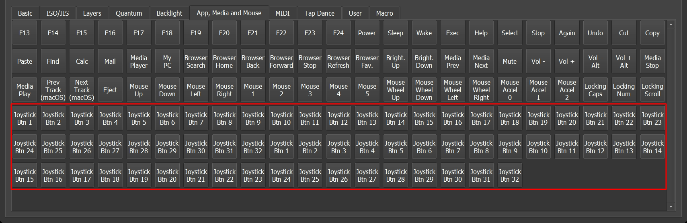

# Joystick

Joystick can be used to send Joystick events thru USB Joystick interface.



In order to enable Joystick support in your firmware, follow these steps:

## 1. Add QMK Joystick support to `config.h`

Follow [QMK documentation](https://docs.qmk.fm/#/feature_joystick) in order to configure Joystick.

## 2. Enable Joystick in `rules.mk`

Add `JOYSTICK_ENABLE = yes` to your `rules.mk` file.

## 3. Add Vial Joystick as part of KLE keymap

To enable **Joystick** on **VIAL** it is necessary to add this lines to the `vial.json` file

```
{ "vial": {
        "Joystick": true
        ...
    }
}

```

## Done!
