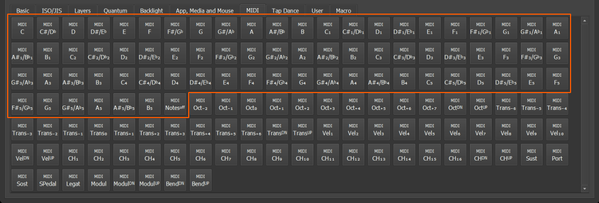

# MIDI

MIDI can be used to send MIDI commands thru USB MIDI interface.

**QMK** has 2 systems for MIDI, **BASIC** and **ADVANCED**.

With MIDI **BASIC** you only can use notes keycodes (keys inside the red polygon) but not other keycodes like octave shift, channel change, modulation, etc.



In order to enable MIDI support in your firmware, follow these steps:

## 1. Add QMK MIDI support to `config.h`

Follow [QMK documentation](https://docs.qmk.fm/#/feature_midi) in order to configure MIDI. Note that you do not need to implement any callbacks, the only changes should be within the `config.h` and `rules.mk` files.

## 2. Enable MIDI in `rules.mk`

Add `MIDI_ENABLE = yes` to your `keymaps/vial/rules.mk` file.

## 3. Add Vial MIDI as part of KLE keymap

To enable **BASIC** or **ADVANCED** **MIDI** on Vial it is necessary to add one of these lines to the `vial.json` file

```
{ "vial": {
        "midi": "basic"
        ...
    }
}

```

or

```
{ "vial": {
        "midi": "advanced"
        ...
    }
}
```

## Done!
