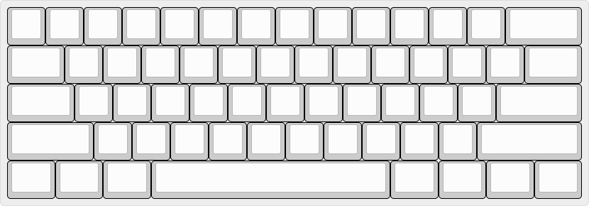
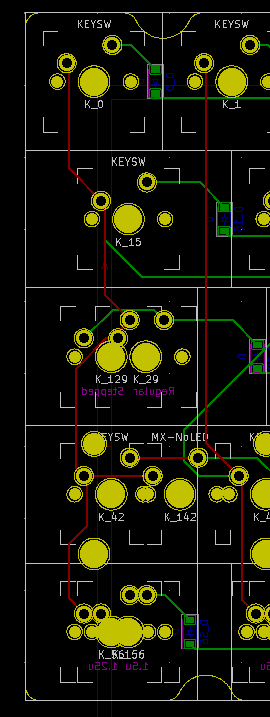
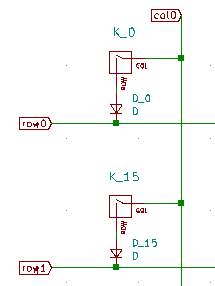
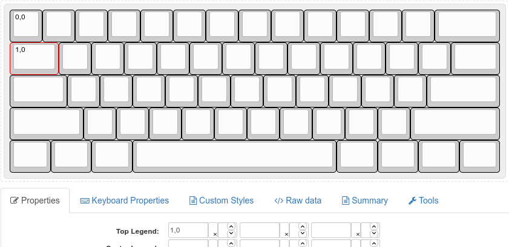
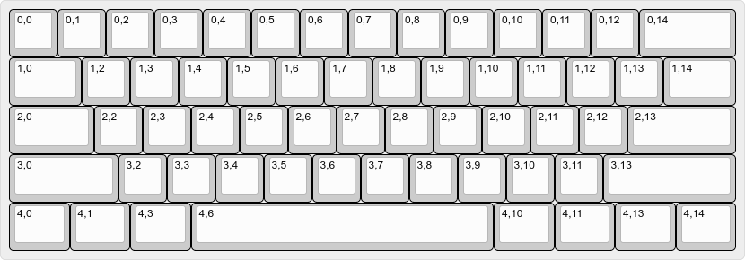
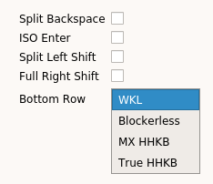
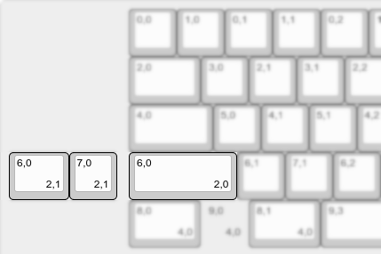
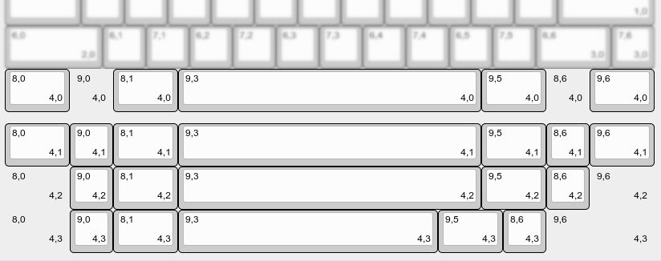
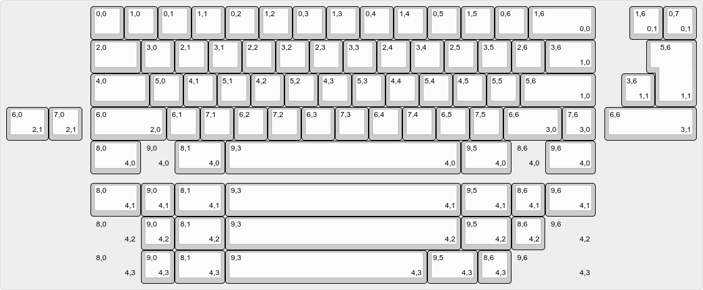

> Information
> {: .label .label-green }
> `vial-qmk` provides several examples of most common microcontroller configurations set up for Vial usage. You can check them out at [`vial-qmk/keyboards/vial_example`](https://github.com/vial-kb/vial-qmk/tree/vial/keyboards/vial_example).

# Create keyboard definition JSON

The first step for creating a Vial port is to prepare a keyboard definition which is a JSON file describing the layout of the keyboard. If your keyboard already has a VIA port, you can download its keyboard definition from the [VIA repository](https://github.com/the-via/keyboards/tree/master/src) and proceed directly to the [second step](/porting-to-vial.md): adding Vial support. Otherwise, follow the steps as described below.

> Notice!
> {: .label .label-red }
> The file structure and content of `info.json` and `vial.json` is vastly different. Copying/renaming one to the other does NOT work.

## 1. Prepare keyboard layout

### Create a physical layout

Keyboard definition layouts are based on KLE data with additional information encoded within keys' legends. Go to [http://www.keyboard-layout-editor.com/](http://www.keyboard-layout-editor.com/) and create a layout that physically represents your keyboard. Use the "Tools -> Remove Legends" action in order to clean up any existing legends:



Next, you will need to correlate physical keyboard layout to the switch matrix. The top-left legend of every key is used to identify its position in the matrix, encoded as `row,col`. There are two ways to prepare this data: either from the keyboard PCB and schematic files, or from the QMK layout macro.

### Following an existing QMK layout

If the keyboard already has a QMK port, you can follow the `LAYOUT` macro in order to assign rows and columns to the keys in the KLE. For example, let's take a look at [m0110_usb](https://github.com/vial-kb/vial-qmk/blob/12950db4d8ec1f294b1285e9b554a8fdc0a4bc6d/keyboards/converter/m0110_usb/m0110_usb.h#L69-L90):


```
#define LAYOUT_ansi( \
    K32, K12, K13, K14, K15, K17, K16, K1A, K1C, K19, K1D, K1B, K18, K33,  K47, K68, K6D, K62, \
    K30, K0C, K0D, K0E, K0F, K11, K10, K20, K22, K1F, K23, K21, K1E,       K59, K5B, K5C, K4E, \
    K39, K00, K01, K02, K03, K05, K04, K26, K28, K25, K29, K27,      K24,  K56, K57, K58, K66, \
    K38, K06, K07, K08, K09, K0B, K2D, K2E, K2B, K2F, K2C,           K4D,  K53, K54, K55, K4C, \
    K3A, K37,                K31,                K34, K2A, K46, K42, K48,  K52,      K41 \
) { \
    { K00, K01, K02, K03, K04, K05, K06, K07 }, \
    { K08, K09, XXX, K0B, K0C, K0D, K0E, K0F }, \
    { K10, K11, K12, K13, K14, K15, K16, K17 }, \
    { K18, K19, K1A, K1B, K1C, K1D, K1E, K1F }, \
    { K20, K21, K22, K23, K24, K25, K26, K27 }, \
    { K28, K29, K2A, K2B, K2C, K2D, K2E, K2F }, \
    { K30, K31, K32, K33, K34, XXX, XXX, K37 }, \
    { K38, K39, K3A, XXX, XXX, XXX, XXX, XXX }, \
    { XXX, K41, K42, XXX, XXX, XXX, K46, K47 }, \
    { K48, XXX, XXX, XXX, K4C, K4D, K4E, XXX }, \
    { XXX, XXX, K52, K53, K54, K55, K56, K57 }, \
    { K58, K59, XXX, K5B, K5C, XXX, XXX, XXX }, \
    { XXX, XXX, K62, XXX, XXX, XXX, K66, XXX }, \
    { K68, XXX, XXX, XXX, XXX, K6D, XXX, XXX } \
}
```

The first section of the macro shows the layout similar to what it should look like in the KLE:

<pre>
    <b>K32</b>, K12, K13, K14, K15, K17, K16, K1A, K1C, K19, K1D, K1B, K18, K33,  K47, K68, K6D, K62, \
    K30, K0C, K0D, K0E, K0F, K11, K10, K20, K22, K1F, K23, K21, K1E,       K59, K5B, K5C, K4E, \
    K39, K00, K01, K02, K03, K05, K04, K26, K28, K25, K29, K27,      K24,  K56, K57, K58, K66, \
    K38, K06, K07, K08, K09, K0B, K2D, K2E, K2B, K2F, K2C,           K4D,  K53, K54, K55, K4C, \
    K3A, K37,                K31,                K34, K2A, K46, K42, K48,  K52,      K41 \
</pre>

The second section of the macro defines how a specific entry translates to the row and column position:

<pre>
    { K00, K01, K02, K03, K04, K05, K06, K07 }, \
    { K08, K09, XXX, K0B, K0C, K0D, K0E, K0F }, \
    { K10, K11, K12, K13, K14, K15, K16, K17 }, \
    { K18, K19, K1A, K1B, K1C, K1D, K1E, K1F }, \
    { K20, K21, K22, K23, K24, K25, K26, K27 }, \
    { K28, K29, K2A, K2B, K2C, K2D, K2E, K2F }, \
    { K30, K31, <b>K32</b>, K33, K34, XXX, XXX, K37 }, \
    { K38, K39, K3A, XXX, XXX, XXX, XXX, XXX }, \
    { XXX, K41, K42, XXX, XXX, XXX, K46, K47 }, \
    { K48, XXX, XXX, XXX, K4C, K4D, K4E, XXX }, \
    { XXX, XXX, K52, K53, K54, K55, K56, K57 }, \
    { K58, K59, XXX, K5B, K5C, XXX, XXX, XXX }, \
    { XXX, XXX, K62, XXX, XXX, XXX, K66, XXX }, \
    { K68, XXX, XXX, XXX, XXX, K6D, XXX, XXX } \
</pre>

For example, taking the top left key: `K32`, and searching for it in the second array, we find that it is located on the 6th row and 2nd column (when counting from zero). Therefore, you would assign `6,2` to the corresponding key's top-left legend in the KLE.

### Following the PCB schematic

Alternatively, you can follow the PCB schematic for the keyboard in order to determine row and column positions of the keys.

 

For example, here the Tab key is identified as K_15. In the schematic, it is connected to row1 and col0. Therefore, the top-left legend for it should be set to `1,0`. Note that row comes first and that the indexes are zero-based: if in your schematic the first row and the first col are labeled as row1/col1, you will need to subtract 1 from every number you enter.



### Finish preparing your layout

Complete the layout by filling the data for every key:



### Create layout options

For keyboards with multiple layout options, such as supporting ISO Enter or different bottom rows, you can configure additional layout options that will be displayed in the GUI and change how the keyboard is displayed to the user.

* Create labels for the options. You can have boolean (on/off) options, or choice (select box) options. A boolean option is represented as a string, a choice is represented as a list of options with the first element being the caption. These labels will be used in a further step. For example:

<table>
<tr>
<td>
<pre>
"labels":[
    "Split Backspace",
    "ISO Enter",
    "Split Left Shift",
    "Full Right Shift",
    [
        "Bottom Row",
        "WKL",
        "Blockerless",
        "MX HHKB",
        "True HHKB"
    ]
],
</pre>
</td>
<td></td>
</tr>
</table>

* Modify your KLE to include layout options. Layout options utilize bottom right legends in KLE. An option is two numbers separated by a comma, the first is a zero-based option index (in this example, 0: "Split Backspace", ..., 4: "Bottom Row"), second is option choice.
* Layout option keys are separate keys which are typically located to the side of the default option. You can move the entire keyboard around in order to make space for layout option keys.
* For example:

| [](../img/layout-options-lshift.png)  | This configures the option at index 2 ("Split Left Shift"). When the option is enabled (1), the keys indicated with "2,1" become active. When the option is disabled (0), the key indicated with "2,0" is active.  |
| [](../img/layout-options-bottom-row.png)  | This configures the option at index 4 ("Bottom Row"). All the different choices ("WKL": "4,0"; "Blockerless": "4,1"; "MX HHKB": "4,2"; "True HHKB": "4,3") are set up as separate rows. Notice that decal keys are used in place of blockers. [](../img/layout-options-decal.png)  |

* Ensure that the optional keys have the same bounding box. For example, if your left shift is set up as a 2.25u key, the split left shift should have 1.25u+1u keys without any space in between. If the total size of the bottom row is 15u, every bottom row option should be 15u, and decal keys can be used to pad it for layouts such as HHKB.
* The final layout might looks as follows:<sup>[(example)](http://www.keyboard-layout-editor.com/#/gists/a93f0e6f320439e4e1d678cb04ac9af6)</sup>



### Download the JSON

Once the layout is complete, go to the "Raw data" tab in KLE and click on the "Download JSON" button located bottom right. In my case, the output starts like this:

```
[
  [
    "0,0",
    "0,1",
    "0,2",
    "0,3",
    "0,4",
    "0,5",
    "0,6",
    "0,7",
```

## 2. Create a JSON containing the full keyboard definition

Start with the following JSON template:

```json
{
    "lighting": "none",
    "matrix": {
        "rows": 0,
        "cols": 0
    },
    "layouts": {
        "labels":
        "keymap":
    }
}
```

Fill in all the fields:

* `matrix`
  * `rows`: enter the number of rows your keyboard has, this value should match `MATRIX_ROWS` you have in `config.h`
  * `cols`: similarly, this value should match `MATRIX_COLS`
* `layouts`
  * `labels`: layout options array described above goes here; if your keyboard does not have any layout option, you should delete this line. If your keyboard does have layout options, make sure to terminate this line with a comma
  * `keymap`: paste the full contents of KLE JSON you've downloaded in the previous step after the colon symbol
* `name`, `vendorId`, `productId`: while these options are required by VIA, Vial does not need them. You do not have to add them, and even if you do, their contents will not be used

See [here](https://github.com/vial-kb/vial-qmk/blob/12950db4d8ec1f294b1285e9b554a8fdc0a4bc6d/keyboards/idb/idb_60/keymaps/vial/vial.json) for an example of a keyboard definition JSON with multiple layout options.

## 3. Test and verify your layout

Before compiling a firmware using your newly created `vial.json` file, it is highly encouraged to test that the file displays and behaves as expected first, since a *technically correct* file with a complete but perhaps _visually incorrect_ layout will not be handled by the compiler.

**To do this open up the Vial application and click `File` -> `Load dummy JSON` and select your file.**

A representation of your keyboard should now be shown on the screen, with the correct keys, in a resonably similar layout to as it was displayed in [http://www.keyboard-layout-editor.com/](http://www.keyboard-layout-editor.com/) or in real life. 

All layout options should be present and selectable as well as encoders shown as two round buttons with arrows (CW/CCW) and a normal button representing the click. 

If the layout is showing incorrectly, or loading the file results in an error message, this needs to be corrected before compiling. 

> Information 
> {: .label .label-green } 
> Error messages are as near verbose as possible. Simply reading the error message gives a good clue as to what you need to correct!

## Done!

This should be enough to get you a basic keyboard definition JSON file. Next, move onto [building Vial support](/porting-to-vial.md).

Did you run into a problem? You can get porting support by joining [Vial discord](https://discord.gg/zNKEUXTKwF).
