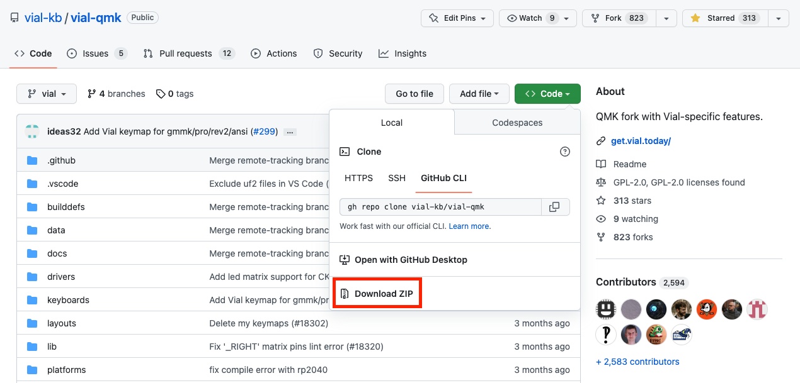

> Information
> {: .label .label-green }
> `vial-qmk` provides several examples of most common microcontroller configurations set up for Vial usage. You can check them out at [`vial-qmk/keyboards/vial_example`](https://github.com/vial-kb/vial-qmk/tree/vial/keyboards/vial_example).

# Porting to Vial

The second part of this tutorial will guide you through porting your keyboard to Vial.

Before continuing, familiarize yourself with basic command line commands (cd, mkdir, ls, rm). 

## 1. Clone the Vial QMK fork

In order to compile keyboard firmware, `vial-qmk` needs to be copied to the computer that will be used for compiling.

### High level guide:
1. Clone the latest version of the repository from [https://github.com/vial-kb/vial-qmk](https://github.com/vial-kb/vial-qmk) into a new directory; this can be different from your main QMK directory if you have that setup elsewhere. If you get stuck, please refer to the main QMK install guide [here](https://docs.qmk.fm/#/newbs_getting_started).
2. Run `make git-submodule` in your new `vial-qmk` directory to clone the git submodules.
3. Continue to run `make path/to/your/keyboard:keymap` for Vial builds from this directory. Make sure the `default` keymap for your keyboard compiles successfully. For example, if your keyboard is located in the `keyboards/xyz/xyz60` folder, to compile it using the `default` keymap, type `make xyz/xyz60:default`.

### If that made absolutely no sense:
1. Download the zip from [https://github.com/vial-kb/vial-qmk](https://github.com/vial-kb/vial-qmk) that is found here:

2. Unzip the zip and place the new `vial-qmk` folder in a place that is findable
3. Navigate to the new `vial-qmk` directory in CLI
4. Run `make git-submodule` from the `vial-qmk` directory


## 2. Create a new `vial` keymap

Duplicate `keyboards/[keyboard_path]/keymaps/default` and rename copy to `keymaps/vial`. Once you're done, the `keymaps` folder should have both a `default` folder and `vial` folder.

## 3. Enable Vial in your rules file

Create a new file in `[keyboard_name]/keymaps/vial/` with the name `rules.mk` and containing the following contents:<sup>[(example)](https://github.com/vial-kb/vial-qmk/blob/90f3b0e2e188eccb23ed8a2a690df278a0f1057b/keyboards/vial_example/vial_atmega32u4/keymaps/vial/rules.mk#L2)</sup>

```
VIA_ENABLE = yes
VIAL_ENABLE = yes
```

## 4. Move JSON so Vial can find it

Place your keyboard definition JSON (either one made in step 1 of this tutorial or downloaded from the [VIA keyboards repository](https://github.com/the-via/keyboards/tree/master/src)) in `[keyboard_name]/keymaps/vial/` and name it `vial.json` so that Vial build process can find it. <sup>[(example)](https://github.com/vial-kb/vial-qmk/blob/90f3b0e2e188eccb23ed8a2a690df278a0f1057b/keyboards/vial_example/vial_atmega32u4/keymaps/vial/vial.json)</sup>

## 5. Generate and add unique keyboard ID

From the root of vial-qmk, run `python3 util/vial_generate_keyboard_uid.py` in order to generate a unique Vial keyboard ID:

`python3 util/vial_generate_keyboard_uid.py`

The result should be something like this:

`#define VIAL_KEYBOARD_UID {0xXX, 0xXX, 0xXX, 0xXX, 0xXX, 0xXX, 0xXX, 0xXX}`

Create a new file in `[keyboard_name]/keymaps/vial/` with the name `config.h` and add the following contents to it:

```
/* SPDX-License-Identifier: GPL-2.0-or-later */

#pragma once

#define VIAL_KEYBOARD_UID {0xXX, 0xXX, 0xXX, 0xXX, 0xXX, 0xXX, 0xXX, 0xXX}
```

The last line should match what you got in the previous step. <sup>[(example)](https://github.com/vial-kb/vial-qmk/blob/90f3b0e2e188eccb23ed8a2a690df278a0f1057b/keyboards/vial_example/vial_atmega32u4/keymaps/vial/config.h#L5)</sup>

## 6. Set up a secure unlock combination

Vial needs a key combination in order to protect the user from a malicious host computer unknowingly changing security-sensitive settings, such as flashing a malicious firmware; for more information see [here](security.md).

If you do not want to utilize this feature, you should set `VIAL_INSECURE = yes` in your `keymaps/vial/rules.mk`. While you can distribute the resulting firmware to your users and will not lose any Vial functionality, note that keyboards which enable `VIAL_INSECURE` will not be accepted to the main `vial-qmk` repository.

For keyboards that do not define `VIAL_INSECURE = yes`, proceed to configure `VIAL_UNLOCK_COMBO_ROWS` and `VIAL_UNLOCK_COMBO_COLS` definitions:

* You should configure a combo of at least 2 keys
* Suppose this is your KLE and you want to configure a combo of Escape+Enter:

* The Escape key is located at [0, 0] and the Enter key is at [2, 13]
* So you should set in your `keymaps/vial/config.h` right below the `VIAL_KEYBOARD_UID` line <sup>[(example)](https://github.com/vial-kb/vial-qmk/blob/90f3b0e2e188eccb23ed8a2a690df278a0f1057b/keyboards/vial_example/vial_atmega32u4/keymaps/vial/config.h#L6-L7)</sup>:
  * `#define VIAL_UNLOCK_COMBO_ROWS { 0, 2 }`
  * `#define VIAL_UNLOCK_COMBO_COLS { 0, 13 }`
* Note that this feature works with multi-layout keyboards, however you should make sure that the keys you pick appear in every possible layout:


After you flash the firmware, check that the function works correctly by activating the "Security->Unlock" menu.

## 7. Compile Vial firmware

Compiling and flashing can be done in a similar way as QMK. To compile a `vial` keymap for a keyboard located at `keyboards/xyz/xyz60/`, run `make xyz/xyz60:vial` from the `vial-qmk/` directory.

If at this point you're having issues making the firmware fit (running out of flash, RAM or EEPROM), see [this guide](firmware-size.md) for how to reduce Vial firmware size.

## Done!

You now should be able to compile the firmware, flash it, and have your keyboard auto-detected by Vial.

Did you run into a problem? You can get porting support by joining [Vial discord](https://discord.gg/zNKEUXTKwF).
