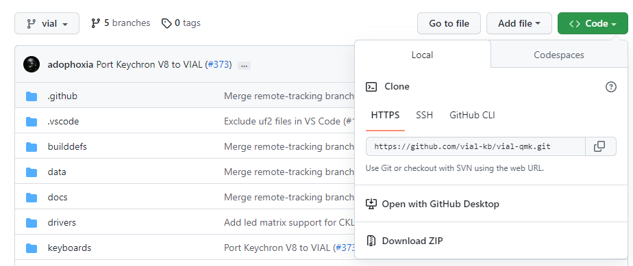

> Information
> {: .label .label-green }
> `vial-qmk` provides several examples of most common microcontroller configurations set up for Vial usage. You can check them out at [`vial-qmk/keyboards/vial_example`](https://github.com/vial-kb/vial-qmk/tree/vial/keyboards/vial_example).

# Porting to Vial

The second part of this tutorial will guide you through porting your keyboard to Vial. **It assumes you will be adapting source code that was written for and known to work with a recent version of [QMK](https://qmk.fm/).** Keyboard designers are strongly suggested to create a `default` QMK keymap first to familiarize themselves with the firmware creation process and correct any errors.

**If you only have precompiled firmware, you will need to obtain the source code for it before proceeding.** [You have the right to ask the maker of your keyboard for this](https://www.gnu.org/licenses/gpl-faq.en.html#ModifiedJustBinary). Reverse-engineering hardware or software is beyond the scope of this guide.

**This requires setting up and using a programming environment in commandline to compile the base firmware.** As such you will need some basic knowledge in navigating the commandline. If you have never encountered this before, [here](https://developer.mozilla.org/en-US/docs/Learn/Tools_and_testing/Understanding_client-side_tools/Command_line#basic_built-in_terminal_commands) is a very basic primer on how to do this.

## 1. Prepare Your Build Environment

> Important
> {: .label .label-red }
> You will need a QMK environment in order to build firmware for Vial. This is not the same thing as QMK Toolbox. If you do not have this, you must first follow QMK's guide [here](https://docs.qmk.fm/#/newbs_getting_started).
> Existing QMK environments may need to be updated, but there is no need to uninstall or remove anything. You can simply move to the appropriate folder when compiling firmware for QMK or Vial-QMK.

### Step by step guide:
1. Clone the latest version of the repository from [https://github.com/vial-kb/vial-qmk](https://github.com/vial-kb/vial-qmk) into a new folder. This folder should be located outside of any existing QMK repository folders. **Nesting `vial-qmk` inside `qmk_firmware` will cause issues, avoid this!**
   - Install the [GitHub Desktop](https://desktop.github.com) version for your OS. Go to [https://github.com/vial-kb/vial-qmk](https://github.com/vial-kb/vial-qmk) and select "Open in Github Desktop". Follow the guided download/cloning.
   - **Advanced Users:** Run `git clone https://github.com/vial-kb/vial-qmk`.



2. Install the prerequisites for compilation.
   - **Advanced Users:** Run `make git-submodule` in your new `vial-qmk` directory to clone the git submodules.
   - **Beginners:** Open QMK MSYS and navigate to your new `vial-qmk` folder to run the above command. Refer to [this guide](https://developer.mozilla.org/en-US/docs/Learn/Tools_and_testing/Understanding_client-side_tools/Command_line#basic_built-in_terminal_commands) on how-to. In the image below, notice how it says 'vial-qmk' at the end of the prompt (vial-qmk]$)? This is your confirmation you have found the correct directory.


3. Verify that your installation is complete by running `qmk doctor`.
   - If you have added a new keyboard folder as part of your port, you will see `Git has unstashed/uncommitted changes.` Other than that, the only warning should be `The official repository does not seem to be configured as git remote "upstream".` (This is fine because Vial-QMK is not the official QMK repository.)
4. Test your Vial-QMK installation by compiling a ***known working*** firmware, for example the QMK version of the firmware you are porting.
   - **Advanced Users:** Run `make path/to/your/keyboard:default`. 
   - **Beginners:** The path does *not* include the folder `vial-qmk/keyboards/` nor does it have a leading slash. It should start with the main name (or designer/group name) of the keyboard.

**The command `make` differs from the QMK recommended command `compile`, please use `make` with Vial-QMK to avoid confusion!**

> You cannot port what doesn't exist!
> {: .label .label-blue }
> If no such QMK firmware exists in the main QMK repository, it will not exist in Vial-QMK either!
> And *porting* which means to *translate* requires a firmware to start from. If you are attempting to create a Vial firmware from scratch, without an existing QMK firmware to start from, you really should have no need of this guide to learn how to do that, as you are far advanced beyond it, go forth and spead your wings!
> If you however do genuinely want to *port* a firmware, you will in fact need one to start from. Either backtrace your steps and find one, or start with making one in QMK before continuing this guide.


## 2. Create a new `vial` keymap

Copy the existing `keymaps/default` folder to `keymaps/vial` with the content intact. Leave the `keymaps/default` folder in place; do not modify or remove it.

## 3. Enable Vial in your rules file

Create a new file (or edit an existing one) under `[keyboard_name]/keymaps/vial/rules.mk` with the following contents:<sup>[(example)](https://github.com/vial-kb/vial-qmk/blob/90f3b0e2e188eccb23ed8a2a690df278a0f1057b/keyboards/vial_example/vial_atmega32u4/keymaps/vial/rules.mk#L2)</sup>

```
VIA_ENABLE = yes
VIAL_ENABLE = yes
```
**Notice! Both commands are explicitly required and cannot be left out!**


Including these in a keyboard level `rules.mk` is not adviced.

## 4. Move JSON so Vial can find it

Place your keyboard definition JSON (either one made in step 1 of this tutorial or downloaded from the [VIA keyboards repository](https://github.com/the-via/keyboards/tree/master/src)) under `[keyboard_name]/keymaps/vial/vial.json` so that Vial build process can find it. <sup>[(example)](https://github.com/vial-kb/vial-qmk/blob/90f3b0e2e188eccb23ed8a2a690df278a0f1057b/keyboards/vial_example/vial_atmega32u4/keymaps/vial/vial.json)</sup>

**Notice! This file is named explicitly `vial.JSON` and cannot have any other name!**


It is also completely different from the `info.JSON` in the keyboards main folder that contains the settings for the QMK base firmware. Don't confuse the two!

## 5. Generate and add unique keyboard ID
The ID generated is unique for the firmware for the keyboard type and model; it does not need to be unique for each individual keyboard.

From the root of vial-qmk, run `python3 util/vial_generate_keyboard_uid.py` in order to generate a unique Vial keyboard ID:

```
python3 util/vial_generate_keyboard_uid.py
#define VIAL_KEYBOARD_UID {0xXX, 0xXX, 0xXX, 0xXX, 0xXX, 0xXX, 0xXX, 0xXX}
```

Create a new file under `[keyboard_name]/keymaps/vial/config.h` and add the following contents to it:

```
/* SPDX-License-Identifier: GPL-2.0-or-later */

#pragma once

#define VIAL_KEYBOARD_UID {0xXX, 0xXX, 0xXX, 0xXX, 0xXX, 0xXX, 0xXX, 0xXX}
```

The last line should match what you got in the previous step. <sup>[(example)](https://github.com/vial-kb/vial-qmk/blob/90f3b0e2e188eccb23ed8a2a690df278a0f1057b/keyboards/vial_example/vial_atmega32u4/keymaps/vial/config.h#L5)</sup>

## 6. Set up a secure unlock combination

Vial needs a key combination in order to protect the user from a malicious host computer unknowingly changing security-sensitive settings, such as flashing a malicious firmware; for more information see [here](security.md).

If you do not want to utilize this feature, you should set `VIAL_INSECURE = yes` in your `keymaps/vial/rules.mk`. While you can distribute the resulting firmware to your users and will not lose any Vial functionality, note that keyboards which enable `VIAL_INSECURE` will not be accepted to the main `vial-qmk` repository.

For keyboards that do not define `VIAL_INSECURE`, proceed to configure `VIAL_UNLOCK_COMBO_ROWS` and `VIAL_UNLOCK_COMBO_COLS` definitions:

* You should configure a combo of at least 2 keys
* Suppose this is your KLE and you want to configure a combo of Escape+Enter:


* The Escape key is located at [0, 0] and the Enter key is at [2, 13]
* So you should set in your `keymaps/vial/config.h` right below the `VIAL_KEYBOARD_UID` line <sup>[(example)](https://github.com/vial-kb/vial-qmk/blob/90f3b0e2e188eccb23ed8a2a690df278a0f1057b/keyboards/vial_example/vial_atmega32u4/keymaps/vial/config.h#L6-L7)</sup>:
  * `#define VIAL_UNLOCK_COMBO_ROWS { 0, 2 }`
  * `#define VIAL_UNLOCK_COMBO_COLS { 0, 13 }`
* Note that this feature works with multi-layout keyboards, however you should make sure that the keys you pick appear in every possible layout:


After you flash the firmware, check that the function works correctly by activating the "Security->Unlock" menu.

## 7. Compile Vial firmware for your keyboard

Compiling and flashing can be done in the same way as QMK. For example, to compile a `vial` keymap for a keyboard located under `keyboards/xyz/xyz60`, run `make xyz/xyz60:vial` from the root `vial-qmk` directory. If at this point you're having issues making the firmware fit (running out of flash, RAM or EEPROM), see [this guide](firmware-size.md) for how to reduce Vial firmware size.

## Done!

You now should be able to compile the firmware, flash it, and have your keyboard auto-detected by Vial.

Did you run into a problem? You can get porting support by joining [Vial discord](https://discord.gg/zNKEUXTKwF).
