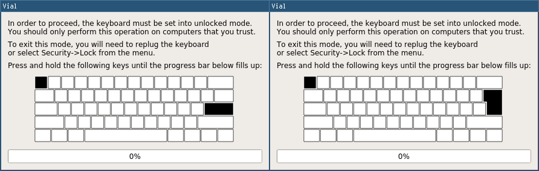

# Vial security notes

In order to prevent a malicious host computer from unknowingly changing sensitive firmware settings (including changing macros or flashing a different firmware), Vial implements an optional set of security features:

* By default, a keyboard is booted in Locked mode
* In order to put the keyboard into Unlocked mode, an action is performed that requires interactive input from the user
  * First, an unlock request is sent to the keyboard through the rawhid endpoint
  * Once the unlock request is received, the keyboard kills all input handling; this is done so that the user has a chance to react if a malicious program unknowingly request unlock mode
  * The user has to hold specific keys for several seconds:

* Once the keyboard is unlocked, all of the security-sensitive actions are allowed (change macro, reset to bootloader, etc)
* The keyboard can be re-locked either by restarting or manually selecting the "Lock" action from the menu

Note that for the purposes of Vial security model we assume the computer is trusted the moment you unlock the keyboard. I.e., once the keyboard is unlocked, it is not possible to protect against malware running on the computer replacing the keyboard firmware in between of you selecting it in the flasher and actually flashing. The goal is to ensure that the firmware cannot be *unknowingly* flashed by a malicious computer.

For instance, you might use the same keyboard on both your home and work computer and perhaps you don't trust the work computer due to it being loaded with monitoring spyware; therefore, you should not perform the unlock action there.

## `VIAL_INSECURE = yes`

This option, when added to rules.mk, will disable Vial security features, treating the board as it is always unlocked.

## List of protected security-sensitive features

* `id_switch_matrix_state` (sort of a keylogger): always disabled, even when using `VIAL_INSECURE`
* `id_dynamic_keymap_macro_set_buffer` (changing a macro): disabled when locked
* `id_bootloader_jump` (reset to bootloader): disabled when locked
* Assigning the RESET keycode is not allowed when the board is locked
