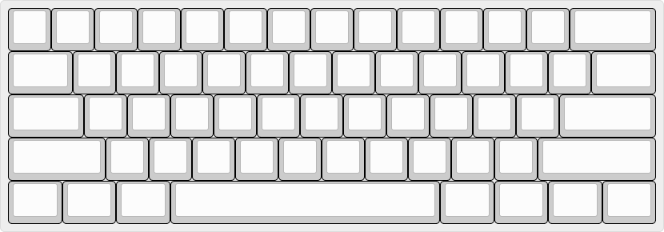
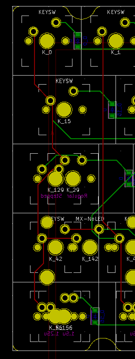
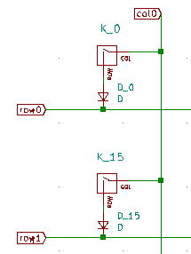
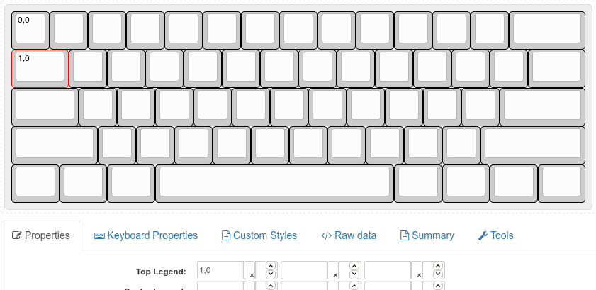
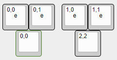
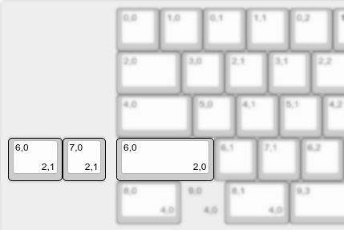
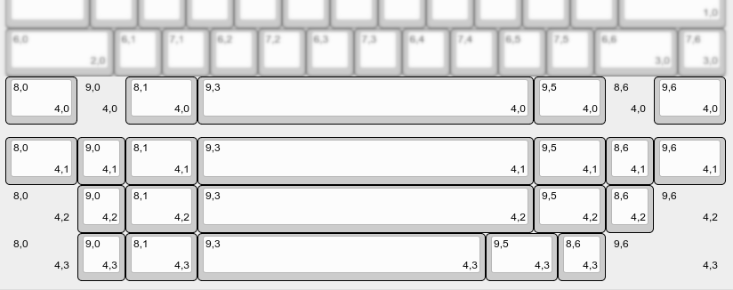

> Information
> {: .label .label-green }
> `vial-qmk` provides several examples of most common microcontroller configurations set up for Vial usage. You can check them out at [`vial-qmk/keyboards/vial_example`](https://github.com/vial-kb/vial-qmk/tree/vial/keyboards/vial_example).

# Create keyboard definition JSON

The first step for creating a Vial port is to prepare a keyboard definition, which is a .JSON file describing the layout of the keyboard. If your keyboard is already supported in VIA, you can download its keyboard definition (keyboard_name.json) from the [VIA repository](https://github.com/the-via/keyboards/tree/master/src) and use that as a starting point.

> Notice!
> {: .label .label-red }
> The file structure and content of the QMK `info.json` and `vial.json` is vastly different. Copying/renaming `info.json` to `vial.json` does NOT work.

> Notice!
> {: .label .label-yellow }
> Simply copying the VIA .JSON file is also not sufficient! Most VIA v2 files contain labels that Vial cannot interpret!

## 1. Create the `vial.json` file

### Create the basic file from a template

The keyboard defenition file contains the data needed to represent the keyboard in the GUI, and should contain **only** this, nothing else.

```json
{
    "lighting": "none",

    "matrix": {
        "rows": 0,
        "cols": 0
     },

     "layouts": {
         "labels": [
              Create optional layouts labels here
              Remove if not used
          ],

          "keymap": [
              Paste KLE data here
          ]
      }
}
```
The first key `"lighting"` defines the RGB controls to enable in Vial's GUI. Please read [here](/lighting.md) for complete options regarding this setting. 

The second key `"matrix"` defines the matrix size in rows and columns, and needs to match the array present in your keymap and `info.json` exactly.

The third key `"layouts"` contains the actual keymap representation and starts with the key "labels" to define layout options. If no optional layouts are used, this part needs to be removed. Remove `"labels": [ ... ],`

The fourth key `"keymap"` contains KLE data **with additional information encoded within the keys' legends.** Go to [http://www.keyboard-layout-editor.com/](http://www.keyboard-layout-editor.com/) and create a layout that physically represents your keyboard. Use the "Tools -> Remove Legends" action in order to clean up any existing legends:



> Notice!
> {: .label .label-yellow }
> Adding other labels not in the template to the file will at best be ignored, but may cause errors. Please define other characteristics of the keyboard elsewhere!

## 2. Insert physical pin data (columns and rows)

Next, you will need to correlate physical keyboard layout to the physical switch matrix. The **top-left legend** of every key is used to identify its position in the matrix, encoded as `row,col`. There are two ways to prepare this data: either from the keyboard PCB and schematic files, or from the QMK layout contained in `info.json`.

### Following an existing QMK layout

If the keyboard already has a QMK port, you can follow the `"LAYOUT"` part of the `info.json` file in order to assign rows and columns to the keys in the KLE.

Notice the `"matrix"` label in the data below. This is what is added to the KLE data. 

```
 "layouts": {
        "LAYOUT": {
            "layout": [
                {"label": "Esc", "matrix": [0, 0], "x": 0, "y": 0.75},
                {"label": "1", "matrix": [0, 1], "x": 1, "y": 0.5},
                {"label": "2", "matrix": [0, 2], "x": 2, "y": 0.25},
                {"label": "3", "matrix": [0, 3], "x": 3, "y": 0},
                {"label": "4", "matrix": [0, 4], "x": 4, "y": 0.25},
                {"label": "5", "matrix": [0, 5], "x": 5, "y": 0.5},
```

### Following the PCB schematic

Alternatively, you can follow the PCB schematic for the keyboard in order to determine row and column positions of the keys.

 

For example, here the Tab key is identified as K_15. In the schematic, it is connected to row1 and col0. Therefore, the top-left legend for it should be set to `1,0`. Note that row comes first and that the indexes are zero-based: if in your schematic the first row and the first col are labeled as row1/col1, you will need to subtract 1 from every number you enter.



### Finish preparing your layout

Complete the layout by filling the data for every key:


## 3. Add Encoders

In the KLE data, an encoder is defined as either ***two or three*** 1u switches, with the labels representing the possible actions it can have (Clockwise/Counter Clockwise rotation). These labels are completely unique to the encoders, and are ***NOT*** part of the matrix.

> Notice!
> {: .label .label-red }
> Not having both rotary switches defined in the KLE data makes the JSON invalid!

The clickable button of an encoder is often a part of the keyboard matrix and not defined as a separate button, as the encoder can replace the keyswitch in the existing matrix. Then the first example defines the encoder actions, and the button remains part of the matrix visually.

### An encoder with no clickable button:


### An encoder with a clickable button:


### Dual encoders with buttons:



Please read [here](/encoders.md) for detailed instructions.

## 4. Create layout options

For keyboards with multiple layout options, such as supporting ISO Enter or different bottom rows, you can configure additional layout options that will be displayed in the GUI and change how the keyboard is displayed to the user.

* Create labels for the options. You can have boolean (on/off) options, or choice (select box) options. A boolean option is represented as a string, a choice is represented as a list of options with the first element being the caption. These labels will be used in a further step. For example:

<table>
<tr>
<td>
<pre>
"labels":[
    "Split Backspace",
    "ISO Enter",
    "Split Left Shift",
    "Full Right Shift",
    [
        "Bottom Row",
        "WKL",
        "Blockerless",
        "MX HHKB",
        "True HHKB"
    ]
],
</pre>
</td>
<td></td>
</tr>
</table>

* Modify your KLE to include layout options. Layout options utilize bottom right legends in KLE. An option is two numbers separated by a comma, the first is a zero-based option index (in this example, 0: "Split Backspace", ..., 4: "Bottom Row"), second is option choice.
* Layout option keys are separate keys which are typically located to the side of the default option. You can move the entire keyboard around in order to make space for layout option keys.
* For example:

| [](../img/layout-options-lshift.png)  | This configures the option at index 2 ("Split Left Shift"). When the option is enabled (1), the keys indicated with "2,1" become active. When the option is disabled (0), the key indicated with "2,0" is active.  |
| [](../img/layout-options-bottom-row.png)  | This configures the option at index 4 ("Bottom Row"). All the different choices ("WKL": "4,0"; "Blockerless": "4,1"; "MX HHKB": "4,2"; "True HHKB": "4,3") are set up as separate rows. Notice that decal keys are used in place of blockers. [](../img/layout-options-decal.png)  |

* Ensure that the optional keys have the same bounding box. For example, if your left shift is set up as a 2.25u key, the split left shift should have 1.25u+1u keys without any space in between. If the total size of the bottom row is 15u, every bottom row option should be 15u, and decal keys can be used to pad it for layouts such as HHKB.
* The final layout might looks as follows:<sup>[(example)](http://www.keyboard-layout-editor.com/#/gists/a93f0e6f320439e4e1d678cb04ac9af6)</sup>


## 5. Download the JSON

Once the layout is complete, go to the "Raw data" tab in KLE and click on the "Download JSON" button located bottom right. In my case, the output looks like this:

```
[
  [
    "0,0",
    "0,1",
    "0,2",
    "0,3",
    "0,4",
    "0,5",
    "0,6",
    "0,7",

    continued data

  ]
]
```

Copy the data including the enclosing brackets and insert in the template file as shown above.

## 6. Test and verify your layout

Before compiling a firmware using your newly created `vial.json` file, it is highly encouraged to test that the file displays and behaves as expected first, since a *technically correct* file with a complete but perhaps _visually incorrect_ layout will not be handled by the compiler.

**To do this open up the Vial application and click `File` -> `Load dummy JSON` and select your file.**

A representation of your keyboard should now be shown on the screen, with the correct keys, in a resonably similar layout to as it was displayed in [http://www.keyboard-layout-editor.com/](http://www.keyboard-layout-editor.com/) or in real life. 

All layout options should be present and selectable as well as encoders shown as two round buttons with arrows (CW/CCW) and a normal button representing the click. 

If the layout is showing incorrectly, or loading the file results in an error message, this needs to be corrected before compiling. 

> Information 
> {: .label .label-green } 
> Error messages are as near verbose as possible. Simply reading the error message gives a good clue as to what you need to correct!

### Done!

This should be enough to get you a basic keyboard definition JSON file. Next, move onto [building Vial support](/porting-to-vial.md).

Did you run into a problem? You can get porting support by joining [Vial discord](https://discord.gg/zNKEUXTKwF).