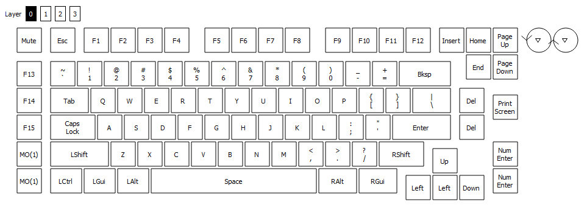

# Rotary encoders

Vial implements optional GUI configuration for rotary encoders. This allows users to set up  separate keycode actions for clockwise and counterclockwise encoder rotations. Encoders fully support QMK layers, so different keycodes can be used for different layers.

You will need to port your keyboard over to Vial before encoders are supported. Follow [Step 1](/porting-to-via.md) and [Step 2](/porting-to-vial.md) to get started.

In order to enable encoder support in your firmware, follow these steps:

## 1. Add QMK encoder support to `config.h`

Follow [QMK documentation](https://docs.qmk.fm/#/feature_encoders?id=encoders) in order to configure encoders. Note that you do not need to implement any encoder callbacks, the only changes should be within the `config.h` and `rules.mk` files.

## 2. Enable Vial encoders in `rules.mk`

Add `VIAL_ENCODERS_ENABLE = yes` to your `keymaps/via/rules.mk` file.

## 3. Add Vial encoders as part of KLE keymap

Set up encoders as 1u switches:
- the center legend should be "e"
- the top left legend is "encoder_index,encoder_rotation", for example "0,0" for rotating encoder at index 0 counterclockwise, and "0,1" for rotating encoder at index 0 clockwise. You do not need to make these values unique from your other key coordinates as these keys will be compiled differently due to the "e" present on the legends.<sup>[(example)](http://www.keyboard-layout-editor.com/#/gists/604ca4b3942891950597cbaceac8bced)</sup>
- Exporting the json from KLE will introduce the following lines to your file, these relate to the encoder:
```
  ["0,0\n\n\n\n\n\n\n\n\ne",
  "0,1\n\n\n\n\n\n\n\n\ne"],
```


### **9 Key macro pad example**
Building a basic 9 key macro pad and a rotary encoder (without button) will produce the following. <sup>[(example KLE file)](http://www.keyboard-layout-editor.com/#/gists/f6c1df29df0d44744d9a4dafe26178ef)</sup>


```json
{
    "name": "NinetyOne",
    "vendorId": "0xXXXX",
    "productId": "0xXXXX",
    "lighting": "none",
    "matrix": {
        "rows": 3,
        "cols": 3
    },
    "layouts": {
        "keymap": [
        [
          { "y": 0.25, "x": 0.5 },
          "0,0\n\n\n\n\n\n\n\n\ne",
          "0,1\n\n\n\n\n\n\n\n\ne"],
        [ {"y": 0.25},
          "0,0", "0,1", "0,2"],
          ["1,0", "1,1", "1,2"],
          ["2,0", "2,1", "2,2"]
        ]
    }
}

```


## Done!

Compile and flash the firmware, and you should be able to configure encoders in the UI:


