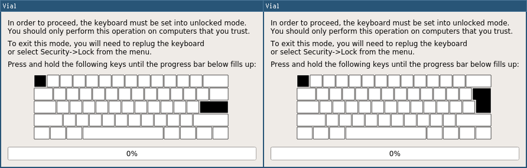

> Information
> {: .label .label-green }
> `vial-qmk` provides several examples of most common microcontroller configurations set up for Vial usage. You can check them out at [`vial-qmk/keyboards/vial_example`](https://github.com/vial-kb/vial-qmk/tree/vial/keyboards/vial_example).

# Porting a VIA keyboard to Vial

The second part of this tutorial will guide you through porting your VIA keyboard to Vial.


## 1. Clone the Vial QMK fork

Vial is currently not included into the main QMK repository. As such, you will need to check out Vial's QMK fork `vial-kb/vial-qmk` and port your keyboard there before getting started with the rest of this tutorial.

> Information
> {: .label .label-green }
> If you've started with the Part 1 of this tutorial, you may have already completed this step


### High level guide:
1. Clone the latest version of the repository from [https://github.com/vial-kb/vial-qmk](https://github.com/vial-kb/vial-qmk) into a new directory, this can be different from your main QMK directory if you have that setup elsewhere. If you get stuck, please refer to the main QMK install guide [here](https://docs.qmk.fm/#/newbs_getting_started).
2. Run `make git-submodule` in your new directory to clone the git submodules.
3. Continue to run your `make path/to/your/keyboard:keymap` for Vial builds from this directory. Make sure the `default` keymap for your keyboard compiles successfully. For example, if your keyboard is located in `keyboards/xyz/xyz60`, to compile it using `default` keymap type `make xyz/xyz60:default`.


## 2. Enable Vial in your rules file

In your `[keyboard_name]/keymaps/via/rules.mk` add `VIAL_ENABLE = yes` as a new line after `VIA_ENABLE = yes`. <sup>[(example)](https://github.com/vial-kb/vial-qmk/blob/cfd6dd6176142a547a85ccd8bcfcd8031985ef11/keyboards/vial_example/vial_atmega32u4/keymaps/via/rules.mk#L2)</sup>

## 3. Move JSON so Vial can find it

Place your VIA JSON (made in step 1 of this tutorial) under `[keyboard_name]/keymaps/via/vial.json` so that Vial build process can find it. <sup>[(example)](https://github.com/vial-kb/vial-qmk/blob/cfd6dd6176142a547a85ccd8bcfcd8031985ef11/keyboards/vial_example/vial_atmega32u4/keymaps/via/vial.json)</sup>

## 4. Set up and add unique keyboard ID

From the root of vial-qmk, run `python3 util/vial_generate_keyboard_uid.py` in order to generate a unique Vial keyboard ID:

```
python3 util/vial_generate_keyboard_uid.py
#define VIAL_KEYBOARD_UID {0xXX, 0xXX, 0xXX, 0xXX, 0xXX, 0xXX, 0xXX, 0xXX}
```

Then, add this `#define` to your keyboard's `config.h` as a new line. <sup>[(example)](https://github.com/vial-kb/vial-qmk/blob/cfd6dd6176142a547a85ccd8bcfcd8031985ef11/keyboards/vial_example/vial_atmega32u4/config.h#L113)</sup>

## 5. Set up a secure unlock combination

Vial needs a key combination in order to protect the user from a malicious host computer unknowingly changing security-sensitive settings, such as flashing a malicious firmware; for more information see [here](../security.md).

If you do not want to utilize this feature, you should set `VIAL_INSECURE = yes` in your `keymaps/via/rules.mk`.

Otherwise, you should proceed to configure `VIAL_UNLOCK_COMBO_ROWS` and `VIAL_UNLOCK_COMBO_COLS` definitions:

* You should configure a combo of at least 2 keys
* Suppose this is your KLE and you want to configure a combo of Escape+Enter:

* The Escape key is located at [0, 0] and the Enter key is at [2, 13]
* So you should set in your `config.h` right below the `VIAL_KEYBOARD_UID` line <sup>[(example)](https://github.com/vial-kb/vial-qmk/blob/cfd6dd6176142a547a85ccd8bcfcd8031985ef11/keyboards/vial_example/vial_atmega32u4/config.h#L116-L117)</sup>:
  * `#define VIAL_UNLOCK_COMBO_ROWS { 0, 2 }`
  * `#define VIAL_UNLOCK_COMBO_COLS { 0, 13 }`
* Note that this feature works with multi-layout keyboards, however you should make sure that the keys you pick appear in every possible layout:


After you flash the firmware, check that the function works correctly by activating the "Security->Unlock" menu.

## 6. Compile Vial firmware

Compiling and flashing can be done in the same way as QMK. For example, to compile a `via` keymap for a keyboard located under `keyboards/xyz/xyz60`, run `make xyz/xyz60:via` from the root `vial-qmk` directory.

## Done!

You now should be able to compile the firmware, flash it, and have your keyboard auto-detected by Vial.

Next, learn how to [add rotary encoder support](/encoders.md) to allow reprogramming on the fly.
