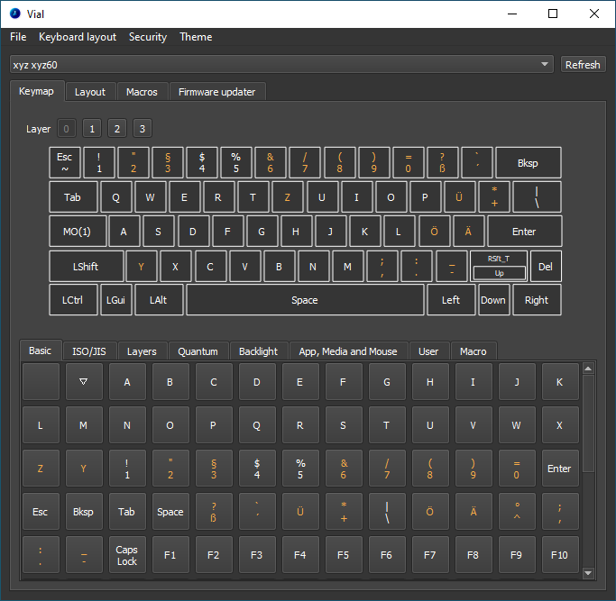

---
# Feel free to add content and custom Front Matter to this file.
# To modify the layout, see https://jekyllrb.com/docs/themes/#overriding-theme-defaults

layout: home
title: Home
nav_order: 1
---

Beta version
{: .label .label-yellow .ml-0 }

{: .vial-logo }

# Vial
{: .my-1 }
### **Vial is an open-source cross-platform (Windows, Linux and Mac) GUI and a QMK fork for configuring your keyboard in real time, similar to VIA.**
{: .mt-1 .mb-8 .text-grey-dk-100 .line-height-fix }

[Download Vial](/download){: .btn .gettingStarted .blue}
[Build support for your keyboard](/gettingStarted/porting-to-via.md){: .btn .gettingStarted}
[Join our Discord server](https://discord.gg/6Ybrtvj6Ae){: .btn .gettingStarted}

If you're already familiar with VIA, the major difference is that Vial is a completely open project, with sources for all components publicly available on [GitHub](https://github.com/vial-kb).

Another big goal for this project is to reduce reliance on third parties when developing a new keyboard.

With Vial, you do not have to submit your keyboard as a pull-request for QMK and/or VIA before it can be used in the GUI; rather, the keymap JSON definition is stored within the keyboard firmware and is retrieved at runtime.

Vial implements several additional quality-of-life features that are documented in the topics linked below including support for [rotary encoders](gettingStarted/encoders.md).

## Documentation topics

* [Porting a keyboard to VIA](/gettingStarted/porting-to-via.md)
* [Porting a VIA keyboard to Vial](/gettingStarted/porting-to-vial.md)
* [Implementing Vial encoder support](gettingStarted/encoders.md)
* [Vial security features and options](/security)
