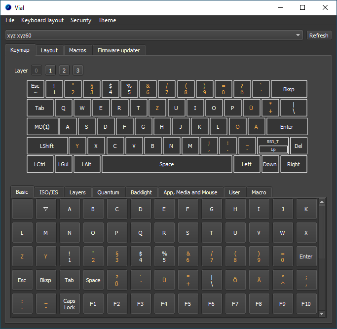

# Vial
{: .my-1 }
**Vial is a feature-rich open-source cross-platform (Windows, Linux and Mac) GUI and a QMK fork for configuring your keyboard in real time.**
{: .mt-1 .mb-8 .text-grey-dk-100 .line-height-fix .fs-5 }

[Start Vial Web](https://vial.rocks/){: .btn .gettingStarted .blue target="_blank"}
[Download Vial](/download){: .btn .gettingStarted .blue}
[Read user manual](){: .btn .gettingStarted}
[Join our Discord server](https://discord.gg/zNKEUXTKwF){: .btn .gettingStarted}

Vial is a keyboard firmware and a companion configurator GUI. Vial enables you to make dynamic, on-the-fly keymap and settings changes without the need to recompile or reflash the firmware. This includes editing keymaps, macros, combos, and other advanced features.

To get started using Vial, [install]() a Vial-compatible firmware on your keyboard (if it did not come preloaded with one) and it will be automatically detected by the Vial GUI.

Vial is a completely open project with sources for all components publicly available on [GitHub](https://github.com/vial-kb). For information about using Vial and porting a new keyboard to Vial, read through the manual entries linked in the sidebar.

Have a feature suggestion for Vial? Feel free to submit it at the dedicated [feedback website](https://feedback.vial.today/).

