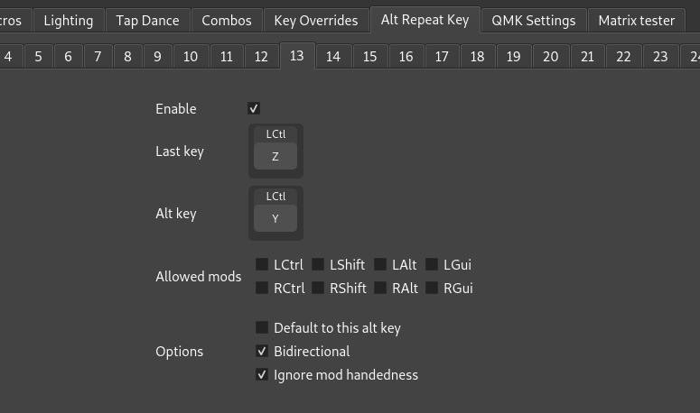

# Alt Repeat Key

The Alt Repeat Key is a key whose behavior depends on the last pressed key. You can find it under the Quantum tab.

By default, Alt Repeat is defined for navigation keys to navigate in the reverse direction. For instance, if the last pressed key was Ctrl + Shift + Right Arrow, the Alternate Repeat Key behaves as Ctrl + Shift + Left Arrow. See [the QMK documentation](https://docs.qmk.fm/features/repeat_key#alternate-repeating) for the default behaviors.

The Alt Repeat Key can be configured. It can be used as a "magic" or "adaptive" key to invoke different macros depending on the last key or to remove same-finger bigrams from the layout.

## Configuring Alt Repeat Key

Click the **Alt Repeat Key** tab at the top of the window and one of the available numbers below it to edit a configuration rule. 

Each rule specifies:

* **Enable**: Check to enable this rule.
* **Last key**: The key pressed before the Alt Repeat Key to invoke this rule.
* **Alt key**: The key that Alt Repeat Key behaves as. 
* **Allowed mods**: Restrict which mods the last key may be pressed with for this rule. 
* **Default to this alt key**: If checked, then this alt key is used by default when no other rule matches.
* **Bidirectional**: The rule is also considered with the roles of last key and alt key reversed.
* **Ignore mod handedness**: If checked, the handedness of any mods in the keycodes and allowed mods are ignored. Useful to consider e.g. last key = "Ctrl+Z" without distinguishing left Ctrl vs. right Ctrl.

A few practical use cases are described next.

## Examples 

### Ctrl+Z / Ctrl+Y

Define Alt Repeat after Ctrl+Z to perform Ctrl+Y, and vice versa (corresponding to Undo and Redo hotkeys in many programs):

* Last key: LCtl(Z)
* Alt key: LCtl(Y)
* Allowed mods: all unchecked
* Default to this alt key: unchecked
* Bidirectional: checked
* Ignore mod handedness: checked

Note: LCtl can be found under the Quantum tab.

### Typing shortcut

Define Alt Repeat after the `K` key to type "`eyboard`", producing "`keyboard`".

First, [define a macro](macro.md), say `M3`, to type the text "`eyboard`". Then add an Alt Repeat rule with

* Last key: `K`
* Alt key: `M3`
* Allowed mods: LShift and RShift checked
* Default to this alt key: unchecked
* Bidirectional: unchecked
* Ignore mod handedness: unchecked

### Adaptive key

Suppose we want Alt Repeat to behave as `U` when typed after `A`, and otherwise behave as `H`. This can be implemented with two rules.

Rule 1:

* Last key: `A`
* Alt key: `U`
* Allowed mods: LShift and RShift checked
* Default to this alt key: unchecked
* Bidirectional: unchecked
* Ignore mod handedness: unchecked

Rule 2:

* Last key: (anything)
* Alt key: `H`
* Allowed mods: all checked
* Default to this alt key: checked
* Bidirectional: unchecked
* Ignore mod handedness: unchecked

In the second rule, the last key has no effect and can be set to anything.

# More info
Alt Repeat Key is a QMK feature and more detailed information can be found with the [offical QMK documenation](https://docs.qmk.fm/features/repeat_key).
