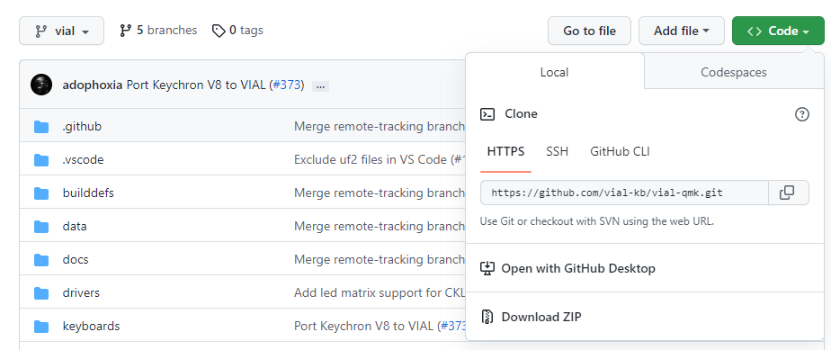
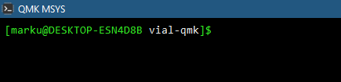

> Important
> {: .label .label-red }
> **The Vial project strongly recommends using vendor-supplied firmware.** Building from source is an advanced, unsupported workflow. The project does not provide build assistance or troubleshoot custom firmware. For help, contact your keyboard vendor or community forums (like the [Discord](https://discord.gg/zNKEUXTKwF) or [r/olkb](https://www.reddit.com/r/olkb/)).

# Installing Vial from source

This section details the process of compiling Vial firmware from source and flashing it to your keyboard.
For most users, compiling Vial firmware is unnecessary. Keyboard vendors typically preload Vial or provide precompiled binaries that can be applied directly (in which case skip ahead to [Flashing firmware](#flashing-firmware)).

> Note
> {: .label .label-green }
> If you just want to download the Vial application to configure a keyboard that already has Vial support, go to the [Download Page](). This guide is for building the firmware from source.

**Who is this for?** This section is intended for keyboard designers, firmware developers, and advanced users who need to build from source for specific reasons, including porting a new keyboard, enabling features, or testing a firmware contribution.

## Setting up your build environment

To compile Vial firmware sources, you must first set up a functioning build environment. Vial firmware reuses QMK's build system, so the steps here are to install QMK, then switch over to using Vial's sources.

Compiling Vial firmware requires some basic knowledge of how to use a command line environment—a bit more than just `qmk compile`. If you are unfamiliar with commands such as `cd` and `pwd`, please read through [this basic primer](https://developer.mozilla.org/en-US/docs/Learn/Tools_and_testing/Understanding_client-side_tools/Command_line#basic_built-in_terminal_commands) to learn the commands you'll need to know.

> Important
> {: .label .label-red }
> You will need a QMK environment in order to build firmware for Vial. This is not the same thing as QMK Toolbox. If you do not have this, you must first [follow QMK's guide](https://docs.qmk.fm/#/newbs_getting_started).
> Existing QMK environments may need to be updated, but there is no need to uninstall or remove anything. You can simply `cd` to the appropriate folder when compiling firmware for QMK vs. Vial-QMK.

1. **Install QMK**: Follow the official [Setting Up Your QMK Environment](https://docs.qmk.fm/newbs_getting_started) guide.
    * **Windows users**: It is recommended to use **QMK MSYS** as your shell environment. QMK MSYS is also used for running the shell commands in the following steps.

2. **Verify installation**: Ensure that the `qmk` command is available in your terminal by running the following shell command, which should complete without errors:

   ```bash
   qmk -V
   ```

3. **Clone the repository**: Vial maintains a fork of the QMK repository with enhancements for dynamic keymap editing. You must use this repository rather than the mainline QMK firmware sources.

   Run the following command to clone the `vial-kb/vial-qmk` repository:

   ```bash
   git clone git@github.com:vial-kb/vial-qmk.git
   ```

   *Note: To avoid confusion, do not clone `vial-qmk` inside an existing QMK repository folder.*

   If you are unfamiliar with git and want a GUI version, install the [GitHub Desktop](https://desktop.github.com) version for your OS. Go to [https://github.com/vial-kb/vial-qmk](https://github.com/vial-kb/vial-qmk) and select "Open in Github Desktop". Follow the guided download/cloning.

   

4. **Navigate to the directory**:

   ```bash
   cd vial-qmk
   ```

   In the image below, notice how it says "`vial-qmk`" at the end of the prompt. This is your confirmation you have found the correct directory.

   

5. **Verify the branch**: The default branch `vial` is the correct one to use. Confirm you are on it by running:

   ```bash
   git checkout vial
   ```

   If you were already on the `vial` branch, this will simply confirm it.

6. **Initialize submodules**: Vial depends on several git submodules. Initialize them by running:

   ```bash
   make git-submodule
   ```

7. **Verify environment**: Run the diagnostic tool to ensure everything is configured correctly:

   ```bash
   qmk doctor
   ```

   (If you are [porting a keyboard]() and have added a new keyboard folder, you will see `Git has unstashed/uncommitted changes.` Other than that, the only warning should be `The official repository does not seem to be configured as git remote "upstream".` This is fine because Vial-QMK is not the mainline QMK repository.)


## Finding your keyboard

Once your environment is set up, the next step is to locate the firmware sources specific to your keyboard.

Under the `vial-qmk` folder, search the `keyboards` folder to locate your specific keyboard model. The folder structure mirrors that of upstream QMK, and [QMK's Keyboard Browser](https://browse.qmk.fm/) can be used to search for a specific model. The path for a keyboard model is typically of the form "`vial-qmk/keyboards/<vendor>/<model>`." Some models include a variant or revision name as part of the path, like "`vial-qmk/keyboards/<vendor>/<model>/<variant>`." If you cannot find it, ask your keyboard vendor.

Within your keyboard's directory, verify that a folder `keymaps` with subfolder `vial` exists. If so, Vial is already supported for your keyboard. If no subfolder named `vial` exists, the keyboard is not ported yet (or the firmware is available elsewhere!) and the keyboard folder is simply inherited from QMK. Refer to the [Porting Guide]() to add support.

*Example:* The `vial` keymap for the ZSA Voyager is located at
`vial-qmk/keyboards/zsa/voyager/keymaps/vial`.

If you can't find your keyboard...

* **If your keyboard is in mainline QMK but not in vial-qmk**, you can often copy your keyboard's folder from your QMK installation into `vial-qmk/keyboards/`, then follow the [Porting Guide]() to add a `vial` keymap.

* **If you only have precompiled firmware, you will need to obtain the source code for it before proceeding.** [You have the right to ask the maker of your keyboard for this](https://www.gnu.org/licenses/gpl-faq.en.html#ModifiedJustBinary). Reverse-engineering hardware or software is beyond the scope of this guide.


## Building firmware

From the root of the `vial-qmk` directory, run this command to build the Vial firmware:

```bash
make <kb>:vial
```

Replace `<kb>` with the path to your keyboard relative to the `keyboards` directory, omitting the `keyboards/` prefix.

> Note
> {: .label .label-green }
> **Why `make` instead of `qmk compile`?** The `qmk` CLI uses whichever directory is set as `QMK_HOME` (usually `~/qmk_firmware`). Running `qmk compile` from the `vial-qmk` directory will still build against your mainstream QMK sources, not Vial. Using `make` directly in the `vial-qmk` directory avoids this pitfall entirely.

*Example*: To build for the ZSA Voyager located at `keyboards/zsa/voyager`, use:

```bash
make zsa/voyager:vial
```

Upon completion, the compiled firmware file (usually `.bin`, `.hex`, or `.uf2`) will be located in the `vial-qmk` root directory.


## Flashing firmware

Finally, the compiled firmware needs to be flashed to the keyboard.

With the keyboard connected to the computer, put the keyboard into DFU (device firmware update) mode, for instance by pressing the "Reset" (or "Bootloader") button on the keyboard. There are other ways it might be done, see [QMK's Flashing Your Keyboard](https://docs.qmk.fm/newbs_flashing) documentation for help.

> Warning
> {: .label .label-red }
> Do not unplug the keyboard or otherwise interrupt the flashing process while the firmware is being written.

Then, use the appropriate tool for your keyboard's microcontroller to write the firmware (e.g., QMK Toolbox, dfu-util, or by copying to a mass storage device). Refer to your keyboard vendor's instructions for the specific flashing procedure.

To use QMK's command line flashing functionality, run the following shell command, again replacing "`<kb>`" according to your keyboard model:

```bash
make <kb>:vial:flash
```

**Split keyboards:** If your keyboard is a split design (e.g., Corne, Sofle, Svalboard), you typically need to flash firmware to *both halves*. Flash each half individually by connecting it via USB and repeating the flashing process. Some split keyboards with wired connections between halves may be able to flash both from one side—check your keyboard's documentation.

Once flashing is done, you are ready [to use Vial]()!


## Troubleshooting

### Submodule errors

If `make git-submodule` fails with network errors or the build complains about missing files in `lib/`, try re-initializing submodules:

```bash
git submodule sync
git submodule update --init --recursive
```

### Missing toolchain (`avr-gcc` or `arm-none-eabi-gcc` not found)

QMK's setup should install the necessary compilers, but if you see errors like `avr-gcc: command not found` or `arm-none-eabi-gcc: command not found`, the toolchain for your keyboard's microcontroller is missing. Reinstall it by running:

```bash
qmk setup
```

This will re-run QMK's dependency installer. On Linux, you may need to install packages manually. See [QMK's install guide](https://docs.qmk.fm/newbs_getting_started) for platform-specific instructions.

### Firmware is too large

If the build fails with "`firmware is too large!`," too many features are enabled to fit in flash memory. See the [firmware size guide]() for tips on reducing firmware size.

