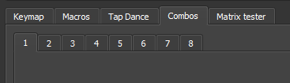
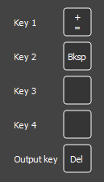

# Combos

Combos allow you to add custom actions when a certain combination of keys is pressed. for example, hitting `A` and `S` within the combo term would hit `ESC` instead, or have it perform even more complex tasks.

## 1. Combos
Click the **Combos** tab at the top and one of the available numbers below it. By default, 8 combos can be configured. This number can be adjusted in firmware at compile (Not GUI) see [here](https://get.vial.today/docs/firmware-size.html) for more info.

The settings for that particular combo will be shown. Up to 4 combination of keys can be configured to activate 1 action. Each key must be pressed within the combo term to be considered a combo. In the case below, pressing the `+/=` key and the `backspace` key will instead trigger the delete key.

## 2. Using a Combo
After the combo has been configured and saved, it can be used. There is no need to assign it to a specific key. 

# More info
Combos is a QMK feature and more detailed information can be found with the [offical QMK documenation](https://docs.qmk.fm/#/feature_combo?id=combos).