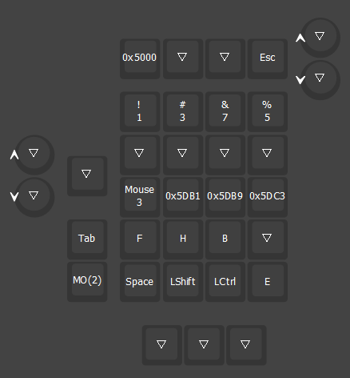
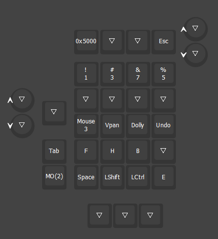
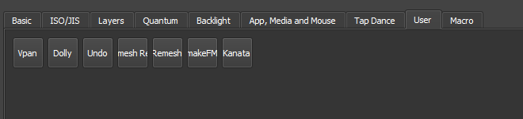

## 1.1 Qmk Custom Keycode

QMK provides [a way](https://github.com/qmk/qmk_firmware/blob/master/docs/custom_quantum_functions.md) for user to redefine behavior for existing key or create new keycode.

Example: Here 3 custom keycodes are defined within `keymap.c`. Enum block is used to assign each keycode a unique hexcode, the behavior of each keycode is defined inside `process_record_user()`. The keycodes are then assigned inside PROGMEM keymaps block. 

```c
enum blender_keycode {
	B_VPAN = SAFE_RANGE,  
    B_DOLLY, 
    B_UNDO, 
}

bool process_record_user(uint16_t keycode, keyrecord_t *record) {
	switch (keycode) {
		case B_VPAN:
			if (record->event.pressed) { 
                // keycode behavior
			}
            return 0;
        case B_DOLLY:
            if (record->event.pressed) {
                // keycode behavior
            return 0;
        case B_UNDO:
            if (record->event.pressed) {
                // keycode behavior
            }
            return 0;
	}
}
```

 When you load a board with custom keycodes, they will appear as unique hexcode. You can use the any key and type in those value `0x5000` to assign them but this isn't very user friendly. 



## 1.2 Vial custom keycode

Via and Vial provides a way to alias custom keycodes so that they appear as a named keycode you can assign.

In `vial.json` make a new list `customKeycodes`, each of the keycode has three property:

- name: the name that will appear on keys, it needs to be short, otherwise the text will overflow.
- title: a short description that will appear when you hover over the keycode.
- shortName: Appears before title. 

For those three keycodes you'd have something like this in your `vial.json`. Watch out for any syntax errors. Item last in the list should not have comma. 

```json
....
"vendorId": "0x0000",
"productId": "0x0000",
"customKeycodes": [
	{"name": "Vpan",
	 "title": "Viewport pan",
	 "shortName": "B_VPAN"
	},
	{"name": "Dolly",
	 "title": "Dolly zoom",
	 "shortname": "B_DOLLY"
	},
	{"name": "Undo",
	 "title": "",
	 "shortName": "B_UNDO"
	}
],
"lighting": "qmk_rgblight",
"matrix": { "rows": 6, "cols": 5 },
....
```

In the keymap.c file, replace `SAFE_RANGE` with `USER00`

```c
enum blender_keycode {
	B_VPAN = USER00, 
    B_DOLLY, 
    B_UNDO, 
}
```

Custom keycodes in the json file __must__ match what's inside the enum block, both in order and number of keycodes. 

If everything goes smoothly the hexcode will be replaced with name of the keycode. You can access all your custom keycode inside the User tab. Do note that the firmware size will incresae slightly (this example is ~100bytes)




