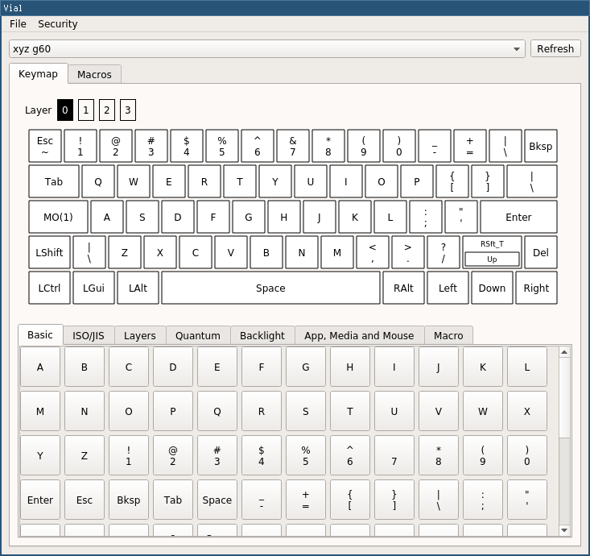

# First time use

> Important
> {: .label .label-red }
> If you are looking to understand how to build support for a keyboard head to the [Porting guide](/docs/) section of the docs.

## 1. Download Vial

Hop over to the [download](/download) page to make sure you have the latest build.

## 2. Run Vial
On Windows and MacOS simply run the installer/executable. 

### Linux

Make sure that your downloaded file can be executed.
You can either do this through your graphical file explorer or use the following command:

```bash
chmod +x ~/Downloads/Vial*.AppImage
```

After that simply launch the application by either double clicking on it or executing the following command:

```bash
~/Downloads/Vial*.AppImage
```

If you discover any bugs please [raise an issue](https://github.com/vial-kb/vial-gui/issues/new/choose).

## 3. Program your new keyboard

Using Vial is extremely simple, just click on a key you would like to change the value of in the top palette then select your replacement key or macro in the bottom palette.

Your new key will be automatically saved onto the keyboard and immediately ready for use.



## 4. My keyboard isn't discovered or it doesn't work.

To work with Vial's GUI your keyboard needs to use a dedicated firmware for Vial. Most keyboards that are advertised as Vial compatible comes pre-flashed with this firmware, but since there are many options on firmware this doesn't apply to all keyboards.

If your keyboard is not using a firmware intended for Vial, it will not work with Vial's GUI, or it may have limited functionality (older VIA firmware). To have full use of Vial's functions, you need to flash your keyboard with a firmware intended for Vial. 

This firmware may be supplied by your keyboards manufacturer/vendor or designer, approach them for help aquiring it. Refer to [QMK's guides on flashing](https://docs.qmk.fm/#/newbs_flashing), if you need basic help with flashing an existing precompiled firmware. 

If no such firmware exist, you may have to create it yourself (called ['porting'](https://get.vial.today/docs/porting-to-via.html) the firmware). 

> Information
> {: .label .label-green }
> To find out if an already ported firmware exists for your keyboard, check if a keymap folder named 'vial' exist here [`vial-qmk/keyboards/`](https://github.com/vial-kb/vial-qmk/tree/vial/keyboards/)

If no folder named 'vial' exist, the keyboard is not ported yet (or the firmware is available elsewhere!) and the keyboard folder is simply inherited from QMK. Start porting!
