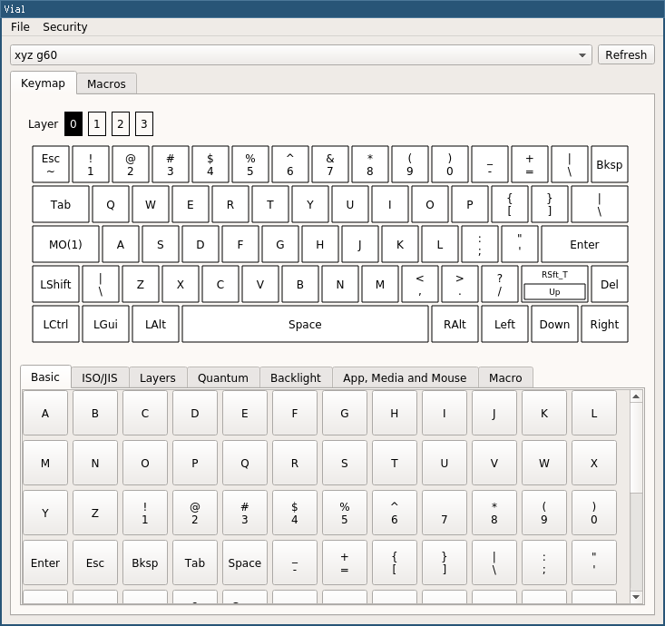

# First time use

> Important
> {: .label .label-red }
> To use Vial, the Vial firmware first needs to be [flashed to the keyboard](), if it hasn't been already.
>
> If you are looking to build support for a keyboard, head to the [Porting guide](/docs/) section of the docs.

## 1. Download Vial

Hop over to the [download](/download) page to make sure you have the latest build.

## 2. Run Vial
On Windows and MacOS simply run the installer/executable. 

### Linux

Make sure that your downloaded file can be executed.
You can either do this through your graphical file explorer or use the following command:

```bash
chmod +x ~/Downloads/Vial*.AppImage
```

After that simply launch the application by either double clicking on it or executing the following command:

```bash
~/Downloads/Vial*.AppImage
```

If you discover any bugs please [raise an issue](https://github.com/vial-kb/vial-gui/issues/new/choose).

## 3. Program your new keyboard

Using Vial is extremely simple, just click on a key you would like to change the value of in the top palette then select your replacement key or macro in the bottom palette.

Your new key will be automatically saved onto the keyboard and immediately ready for use.



Many of QMK's features are accessed under the [Quantum tab](), including one-shot mods (`OSM mod`) and mod-tap keys (`LSft_T(kc)`, `LCtl_T(kc)`, etc.; note the "`_T`" suffix).


## My keyboard isn't discovered or it doesn't work.

To work with Vial's GUI, your keyboard needs to use a dedicated firmware for Vial. Most keyboards that are advertised as Vial compatible come pre-flashed with this firmware, but since there are many options on firmware, this doesn't apply to all keyboards.

If your keyboard is not using a firmware intended for Vial, it will not work with Vial's GUI, or it may have limited functionality (older VIA firmware). To have full use of Vial's functions, you need to flash your keyboard with a firmware intended for Vial. 

This firmware may be supplied by your keyboards manufacturer/vendor or designer, approach them for help acquiring it. Refer to [QMK's guides on flashing](https://docs.qmk.fm/#/newbs_flashing), if you need basic help with flashing an existing precompiled firmware. 

To compile and flash Vial firmware yourself, refer to the [Installing Vial]() guide.

If your keyboard doesn't show up after flashing Vial firmware, and you're on Linux, 
[you may need to add udev rules.]()

