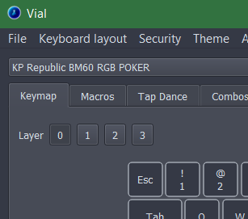
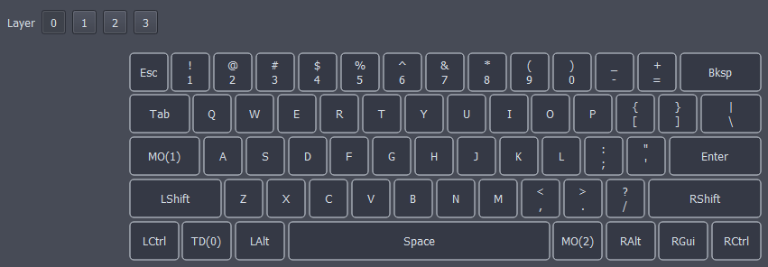
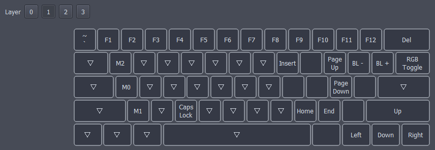

# Layers
Layers provide the ability to change the functionality of the entire keyboard based on what "layer" it's currently on. It's best to visualize layers stacked on top of each other. Keys can be configured to switch between layers as needed similar to function keys on a laptop. 

By default, Vial supports up to 4 keymap layers. This limit [can be adjusted](#adjusting-feature-limits) at compile time (not the GUI) when building firmware.

You can view each layer available by clicking the corresponding number at the top of the interface. You can see we already have layer 0 selected.

A typical layer setup would include a "base" layer and a "Function" layer. 

**Base Layer**

**Function Layer**

You can see additional key functionality is located on the "Function" layer. This is just convention, in reality you can do whatever you want with the layers.

## Moving Between Layers
Switching between what layer is active can be done in a few ways. In the lower palette, select the **layer** tab to view all the different options. 

- <kbd>MO(<i>layer</i>)</kbd> - momentarily activates the layer. As soon as you let go of the key, the layer is deactivated.
- <kbd>DF(<i>layer</i>)</kbd> - changes which layer is the default layer. This stays until the device loses power.
- <kbd>PDF(<i>layer</i>)</kbd> - persistently sets the default layer. This layer setting is saved even when the device loses power.
- <kbd>TG(<i>layer</i>)</kbd> - toggles the layer, activating it if it's inactive and vice versa.
- <kbd>TO(<i>layer</i>)</kbd> - activates *layer* and deactivates all others.
- <kbd>TT(<i>layer</i>)</kbd> - If you hold the key down, the layer is activated, and then is de-activated when you let go (like `MO`). If you repeatedly tap it, the layer will be toggled on or off (like `TG`). It needs 5 taps to do this.
- <kbd>OSL(<i>layer</i>)</kbd> - momentarily activates the layer until the next key is pressed.
- <kbd>LT <i>layer</i> (<i>kc</i>)</kbd> - momentarily activates the layer when it is held, sends a keycode when pressed. The keycode can be defined like all the other buttons, Just select the smaller box inside.
- <kbd>Layer Lock</kbd> - "locks" the current layer to stay on, supposing it was accessed by a `MO`, `LT`, `OSL`, or `TT` layer switch. Pressing Layer Lock again unlocks the layer.

The keymap behaves as a stack of layers in which **multiple layers can be active at once**. Higher layers take precedence, stacking on top of lower layers. Usually, you want a layer switch key on layer *n* to activate layer *n*+1 or higher. If you do want to drop down from a higher layer to a lower layer, use a "`TO`" layer switch.

`LM(layer,mod)` layer mod keys behave like `MO(layer)` while also holding
mods. Layer mod switches are not exposed in the GUI, but can be assigned through [Any key](). For instance, "`LM(3, MOD_LSFT)`" switches to layer 3 and holds Left Shift.

## Transparency
The Triangle <kbd>▽</kbd> symbols represent Transparency. Those mean the action is the same as the layer below it. This is useful so that keys from different layers can be pressed at the same time. 
