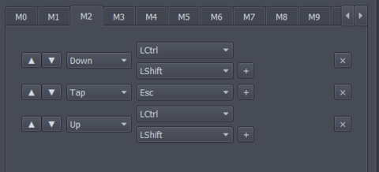
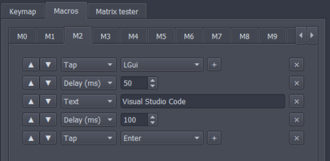
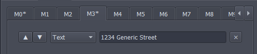
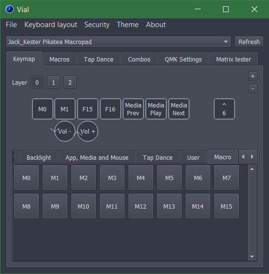

# Macros

Macros can be used to perform a pre-programmed sequence of actions or steps. 

By default, 16 macros can be configured. This number can be lower as some firmwares do not have enough space for this many macros. 

Some great example uses for macros could be typing out and address, opening a program with a hotkey-shortcut or filling out a form.

## 1. Configure Macros
Click the **Macros** tab. All the macros that can be configured will be displayed as seperate tabs. Select a Macro you would like to configure. In the picture below **M0** is selected


The next step is to add actions. In the bottom right corner, you can 
* **Add action** - Manually adds an action to the list. Configure it to do exactly what you want. select from different options - hold, tap, release, and delay.
* **Tap Enter** - Lots of macros end with an "Enter" key so this button makes it easier to add that.
* **Record macro** - Lets you record the macro directly from your keyboard. It's not the most reliable but it's a great place to start.

Use these buttons to add actions to the list. These will be perfomed in order when the macro is activated.

Actions can be reordered using the arrows on the left. 

When you are satisfied with the configuration of all macros, click **save** to save all changes. If you want to revert to what is already on the device, click **revert**

### Examples
1. Opens Task Manager on Windows by pressing Ctrl+Shift and then tapping Esc

    

2. Launch a program on Windows by opening the Start Menu, typing out the program name, and pressing Enter.

    

3. Type out a street address

    

## 2. Using Macros
After the macro has been configured, it can be used. Just click on a key you would like to use for a macro in the top palette then select your macro in the bottom palette. (under the macro tab)



## 3. Changing the amount of Macros

To increase or decrease the amount of macros you need to define it in your `keymaps/vial/config.h`, where 'xx' is the amount macros you want.
```
#define DYNAMIC_KEYMAP_MACRO_COUNT xx
```
Up to 109 is possible, the amount of macros will not change how much space is reserved for macros but every every blank entry will consume one byte in your EEPROM.

# More info
Macros is a QMK feature and more detailed information can be found with the [offical QMK documenation](https://docs.qmk.fm/#/feature_macros).
