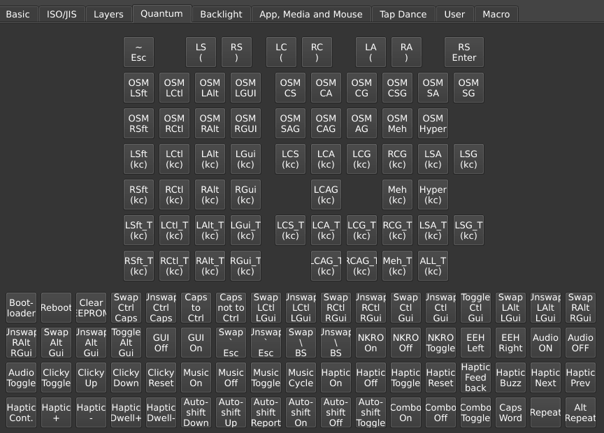

# Quantum

You can find many of QMK's feature under the keymap view in the **Quantum** tab.

## Caps Word

The `Caps Word` key activates Caps Word, capitalizing until end of current word ([QMK docs](https://docs.qmk.fm/features/caps_word)). This key is useful to type a single word in all capitals, like abbreviations.

Caps Word automatically disables once a "word breaking key" is pressed, that is, once Space or anything other than letters A&ndash;Z, digits 0&ndash;9, `-`, `_`, Delete, or Backspace is pressed.

While active, `-` is shifted to `_`. This makes it easier to type e.g. `PROGRAM_CONSTANTS` in code.

## Modifier keys

The keys `LSft(kc)`, `LCtl(kc)`, etc. press a modifier (or a combination of multiple modifiers) together with a key "`kc`" ([QMK docs](https://docs.qmk.fm/feature_advanced_keycodes)). This kind of key is useful to send hotkey chords and AltGr+key combinations with a single physical key press. For instance, `LCtl(C)` sends Left Ctrl + `C`, and `RAlt(A)` sends Right Alt + `A`.

Common aliases:
* `LGui` and `RGui` are the Windows/Command/Super keys.
* `LAlt` and `RAlt` are the Option keys on Mac. Outside the US, `RAlt` is commonly also known as AltGr.

Use the following keys for a combination with multiple mods (to read these abbreviated names, "L" = Left, "R" = Right, and letters "CSAG" represent respectively Ctrl, Shift, Alt, GUI; see the [QMK docs](https://docs.qmk.fm/feature_advanced_keycodes) for the full list of such keys):

* `LCS(kc)` = Left Ctrl + Shift + `kc`
* `LSG(kc)` = Left Shift + GUI + `kc`
* `RCG(kc)` = Right Ctrl + GUI + `kc`
* and so on.

These keys are assigned in two steps: First, select the outer part of the key from the Quantum tab. When placed, the key will display a nested placeholder, representing the inner "`kc`" part of the key. Select this nested area and choose a key from the Basic tab to complete the definition.

The "`kc`" key is limited to keys in the Basic tab. This is [a QMK limitation](https://docs.qmk.fm/mod_tap#caveats). Some mod combinations are not exposed in the GUI, but can be assigned through [Any key]() entry, in which multiple mods can be composed with syntax like "`RALT(RSFT(KC_A))`" for Right Alt + Right Shift + `A`.

## Mod-tap keys

Keys `LSft_T(kc)`, `LCtl_T(kc)`, etc. are mod-tap keys, named like the Modifier keys but with a "`_T`" suffix. These keys produce `kc` when tapped and act as a modifier when held ([QMK docs](https://docs.qmk.fm/mod_tap)).

Like Modifier keys, the "`kc`" key is limited to keys in the Basic tab. This is [a QMK limitation](https://docs.qmk.fm/mod_tap#caveats). Some mod combinations are not exposed in the GUI, but can be assigned through [Any key]() entry like "`MT(MOD_RALT | MOD_RSFT, KC_A)`."

### Tap-hold configuration

When a mod-tap key is pressed, the firmware considers the duration of the press as well as sequencing of surrounding key events to decide whether the key is tapped vs. held. The behavior of mod-tap keys is finely configurable with options in the Tap-Hold tab under [QMK Settings](). The following also apply to [Layer Tap LT keys]().

* **Tapping Term**: A delay in milliseconds that the firmware uses to decide whether a press is a tap or a hold. A typical setting is in the range 150 to 300.

* **Permissive Hold**: If checked, a mod-tap key `MT` is considered held in a "nested" press like "`MT`&darr;, `A`&darr;, `A`&uarr;, `MT`&uarr;," even when the full sequence completes within the tapping term. This option is a balance between favoring the tap vs. hold functions.

* **Hold On Other Key Press**: If checked, the hold function is selected whenever another key is pressed while the mod-tap key is down, even if within the tapping term. This option strongly favors the hold function.

* **Retro Tapping**: By default, holding and releasing a mod-tap key does nothing. With Retro Tapping checked, when releasing before pressing another key, the tapping key is sent.

* **Quick Tap Term**: A delay interval in milliseconds. If a mod-tap key is tapped, then quickly held within this interval, the key's *tapping* function is held. This makes it possible for instance to hold Backspace on a `LCtl(Backspace)` key. Set to 0 to disable this behavior.

* **Chordal Hold**: Applies an "opposite hands rule" if enabled. If a mod-tap key is pressed and then, before the tapping term, another key is pressed on the same hand, the mod-tap key is decided as tapped. This is useful to avoid accidental mod activations in rolled key presses.

* **Flow Tap**: A delay interval in milliseconds. If a mod-tap key is pressed within this interval of the previous key, it is settled as tapped. Effectively, the hold function is disabled during fast typing. A typical settings is around 100.

See [QMK's Tap-hold configuration](https://docs.qmk.fm/tap_hold) documentation for detailed description of these options.

### Setting up home row mods?

Home row mods (HRMs) is an approach where the modifiers (Ctrl, Shift, Alt, GUI) are placed on the home row keys (`A S D F` and `J K L ;`, supposing QWERTY layout) as mod-tap keys. The benefit is reduced finger movement and avoiding awkwardness to press hotkey chords.

A suggested starting point for home row mods in Vial:

* Use the `LCtl_T`, `LSft_T`, etc. mod-tap keys for your home row keys. Don't use Tap Dances for that.

* Under the Tap-Hold tab in QMK Settings, check the boxes for **Permissive Hold** and **Chordal Hold**, and ensure that **Hold On Other Key Press** is *unchecked*. 

* Don't set the tapping term too small. Start with a value of 250&nbsp;ms and adjust from there. If getting many unintended mod holds, increase the tapping term. Or conversely, if getting tapping keys when the mod was intended, decrease the tapping term.

> **Why not Tap Dance?** Mod-tap keys `*_T` use an elaborate set of rules to decide when the key is tapped vs. held, much of this designed with home row mods in mind. Tap Dances use a separate, simpler implementation to track when keys are tapped or held, which is poorly suited for home row mods.

## OSM mod

The `OSM mod` keys are one-shot modifiers, aka sticky keys. One-shot modifiers remain active until the next key is pressed, and are then released ([QMK docs](https://docs.qmk.fm/one_shot_keys)).

Some mod combinations are not exposed in the GUI, but can be assigned through [Any key]() entry with syntax like "`OSM(MOD_RALT | MOD_RSFT)`" for one-shot Right Alt + Right Shift.

## Repeat Key

The `Repeat` key remembers the mods that were active with the last key press. These mods are applied together with any additional mods held when `Repeat` is pressed. If Ctrl + Right Arrow was the last key pressed, then Shift + `Repeat` produces Ctrl + Shift + Right Arrow, useful to select by word.

`Alt Repeat`, by default, sends the opposing key when the last key
was a navigation key. For instance when `PgDn` was the last key, `Alt Repeat` behaves as `PgUp`, and vice versa. Further examples (see [QMK docs](https://docs.qmk.fm/features/repeat_key) for full list):

* `Home` &harr; `End`
* `[` &harr; `]`
* `Vol Up` &harr; `Vol Down`
* `Media Next` &harr; `Media Prev`
* `Wheel Up` &harr; `Wheel Down`
* For Vim, Emacs, and other programs:
  * `J` &harr; `K`
  * `H` &harr; `L`
  * mod + `F` &harr; mod + `B`
  * mod + `D` &harr; mod + `U`
  * mod + `O` &harr; mod + `I`

Alt Repeat's behavior is configurable in the [Alt Repeat Key tab](alt-repeat-key.md).

## Space Cadet keys

Space Cadet keys work similarly to mod-tap keys, behaving differently when tapped vs. held ([QMK docs](https://docs.qmk.fm/features/space_cadet)):

* `LS (` is Left Shift when held, `(` when tapped.
* `RS )` is Right Shift when held, `)` when tapped.
* `LC (` is Left Ctrl when held, `(` when tapped.
* `RC )` is Right Ctrl when held, `)` when tapped.
* `LA (` is Left Alt when held, `(` when tapped.
* `RA )` is Right Alt when held, `)` when tapped.
* `RS Enter` is Right Shift when held, Enter when tapped.

## Other keys

* `Bootloader`: Puts the keyboard into bootloader mode for flashing (`QK_BOOT`).

* `Reboot`: Resets the keyboard without going into bootloader mode.

* `Clear EEPROM`: Clears persistent settings in the keyboard's EEPROM memory.

* `~ Esc`: Grave Escape, a key that sends Escape when pressed by itself or `~` when pressed with Shift ([QMK docs](https://docs.qmk.fm/features/grave_esc)).

* `Swap Ctrl Caps`, etc.: "Magic Keys" functionality for dynamically swapping or disabling certain keys and toggling N-key rollover (NKRO) ([QMK docs](https://docs.qmk.fm/keycodes_magic)).

* Haptic feedback keys ([QMK docs](https://docs.qmk.fm/features/haptic_feedback)).

