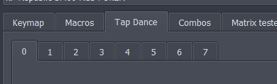
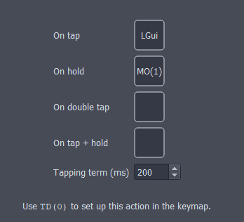
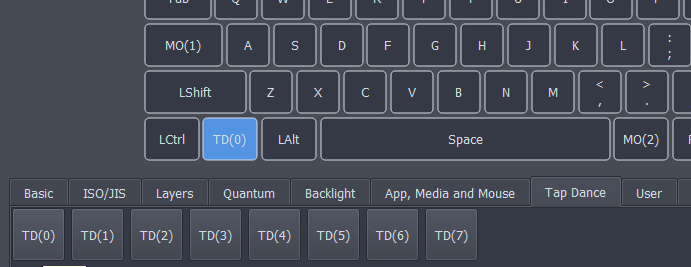

# Tap Dance

Tap Dance allows you to configure different actions depending on how a button is used. For example, the same button could be configured to active a macro when the button is tapped or activate something else when the button is held.

## 1. Configuring Tap Dance
Click the **Tap Dance** tab at the top and one of the available numbers below it. By default, 8 Tap dances can be configured. This number can be adjusted in firmware at compile (Not GUI) see [here](https://get.vial.today/docs/firmware-size.html) for more info.

Each tap dance can be configured to do different actions based on how the button is pressed. In the case below, when the button is "Tapped"(**On tap**), the Left GUI is pressed but when the button is held(**On hold**), the button activates layer 1. The other two options (**On double tap**) and (**On tap + hold**) can also be configured.

The **tapping term** represents the timing on how the firmware distinguishes between the actions. If a button is held for longer than the tapping term it's considered a hold. If a button is held for shorter than the tapping term it's considered a tap.

When you are satisfied with the configuration of all tap dance configurations, click **save** to save all changes. If you want to revert to what is already on the device, click **revert**

## 2. Using a Tap Dance
After the tap dance has been configured and saved, it can be used. Just click on a key you would like to use for a tap dance in the top palette then select your tap dance in the bottom palette. (under the Tap Dance tab)

# More info
Tap Dance is a QMK feature and more detailed information can be found with the [offical QMK documenation](https://docs.qmk.fm/#/feature_tap_dance).