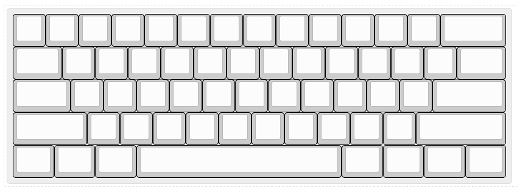
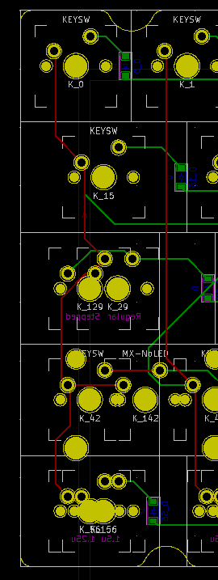
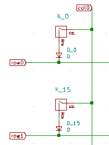
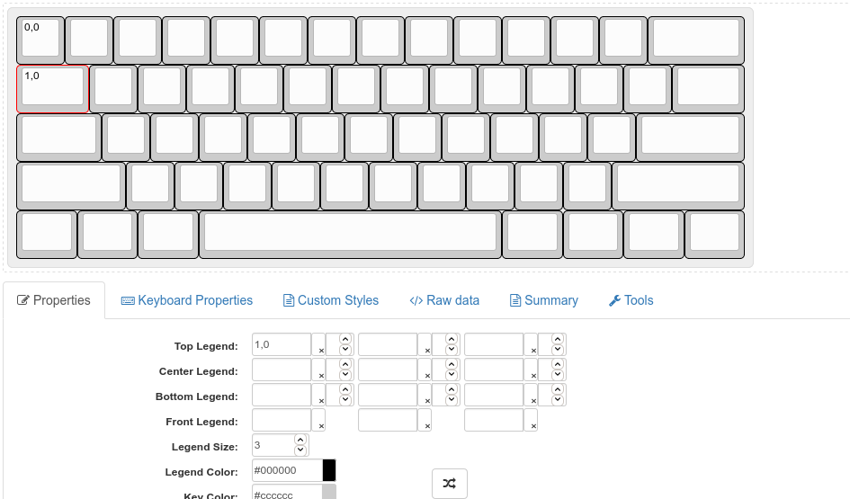
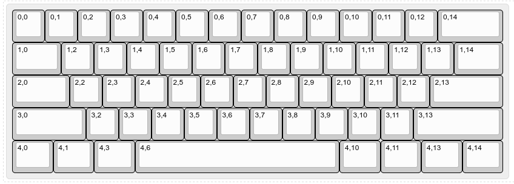
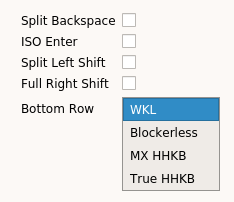
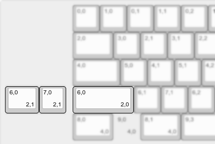
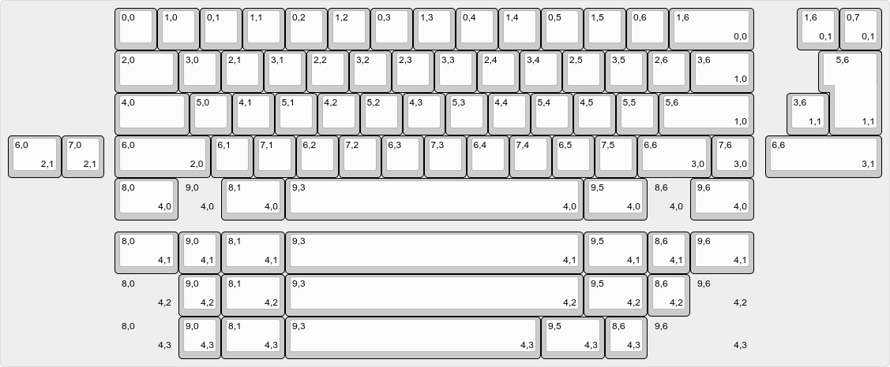

# Porting a keyboard to VIA

The first step is to port your keyboard to VIA. If you already have a working VIA port, you can simply copy it into the `vial-qmk` source tree and proceed to Part 2.

## Caution

These instructions were developed specifically for Vial. While the keymap and JSON you obtain in this step also will work with VIA, the VIA project might have more strict requirements about the contents of your JSON (such as not using 0xFEED vendor ID, and indicating modifier keys). For official VIA documentation, see [here](https://caniusevia.com/docs/specification).

## Base your changes off `vial-kb/vial-qmk`

Vial is currently not included into the main QMK repository. As such, you will need to check out Vial's QMK fork and port your keyboard there before getting started with the rest of the guide:

Clone the latest version of the repository from https://github.com/vial-kb/vial-qmk. Then, copy your keyboard definition under `keyboards`. Make sure the `default` keymap for your keyboard compiles successfully.

## Create a new `via` keymap

Create a new `via` keymap folder located under a path such as `keyboards/<path-to-your-keyboard>/keymaps/via`. This folder should contain the following two files:

* `rules.mk`

    Should contain a single line: `VIA_ENABLE = yes`

* `keymap.c`

    Should contain the default keymap for VIA. This file should contain 4 layers defined explicitly, with unused keys set to `KC_TRNS` by default. An example implementation for a 60% keyboard is provided below:

    ```c
    #include QMK_KEYBOARD_H

    #define ____ KC_TRNS

    const uint16_t PROGMEM keymaps[][MATRIX_ROWS][MATRIX_COLS] = {

        [0] = LAYOUT(
            KC_ESC,  KC_1,    KC_2,   KC_3,   KC_4,   KC_5,   KC_6,   KC_7,   KC_8,   KC_9,    KC_0,    KC_MINS, KC_EQL,  KC_BSLS, KC_BSPC,
            KC_TAB,  KC_Q,    KC_W,   KC_E,   KC_R,   KC_T,   KC_Y,   KC_U,   KC_I,   KC_O,    KC_P,    KC_LBRC, KC_RBRC, KC_BSLS,          
            KC_CAPS, KC_A,    KC_S,   KC_D,   KC_F,   KC_G,   KC_H,   KC_J,   KC_K,   KC_L,    KC_SCLN, KC_QUOT, KC_ENT,           
            KC_LSFT, KC_NUBS, KC_Z,   KC_X,   KC_C,   KC_V,   KC_B,   KC_N,   KC_M,   KC_COMM, KC_DOT,  KC_SLSH, KC_RSFT, KC_UP,   
            KC_LCTL, KC_LGUI, KC_LALT,                        KC_SPC,                          KC_RALT, KC_RGUI, KC_APP,  KC_RCTRL
        ),

        [1] = LAYOUT(
            ____, ____,    ____,   ____,   ____,   ____,   ____,   ____,   ____,   ____,    ____,    ____, ____,  ____, ____,
            ____, ____,    ____,   ____,   ____,   ____,   ____,   ____,   ____,   ____,    ____,    ____, ____, ____,          
            ____, ____,    ____,   ____,   ____,   ____,   ____,   ____,   ____,   ____,    ____, ____, ____,           
            ____, ____, ____,   ____,   ____,   ____,   ____,   ____,   ____,   ____, ____,  ____, ____, ____,   
            ____, ____, ____,                        ____,                          ____, ____, ____,  ____
        ),

        [2] = LAYOUT(
            ____, ____,    ____,   ____,   ____,   ____,   ____,   ____,   ____,   ____,    ____,    ____, ____,  ____, ____,
            ____, ____,    ____,   ____,   ____,   ____,   ____,   ____,   ____,   ____,    ____,    ____, ____, ____,          
            ____, ____,    ____,   ____,   ____,   ____,   ____,   ____,   ____,   ____,    ____, ____, ____,           
            ____, ____, ____,   ____,   ____,   ____,   ____,   ____,   ____,   ____, ____,  ____, ____, ____,   
            ____, ____, ____,                        ____,                          ____, ____, ____,  ____
        ),

        [3] = LAYOUT(
            ____, ____,    ____,   ____,   ____,   ____,   ____,   ____,   ____,   ____,    ____,    ____, ____,  ____, ____,
            ____, ____,    ____,   ____,   ____,   ____,   ____,   ____,   ____,   ____,    ____,    ____, ____, ____,          
            ____, ____,    ____,   ____,   ____,   ____,   ____,   ____,   ____,   ____,    ____, ____, ____,           
            ____, ____, ____,   ____,   ____,   ____,   ____,   ____,   ____,   ____, ____,  ____, ____, ____,   
            ____, ____, ____,                        ____,                          ____, ____, ____,  ____
        ),

    };
    ```

Ensure everything is set up correctly by compiling and flashing your keyboard with the new `via` keymap.

## Create a KLE for VIA

### Create a basic layout

VIA layouts are based on KLE data with additional information encoded within keys' legends. Go to http://www.keyboard-layout-editor.com/ and create a layout that physically represents your keyboard. Use the "Tools -> Remove Legends" action in order to clean up any existing legends:



At this point you will need to correlate physical keyboard layout to the switch matrix. VIA uses top-left legend of every key to identify its position in the matrix, encoded as `row,col`.

 

For example, here the Tab key is identified as K_15. In the schematic, it is connected to row1 and col0. Therefore, the top-left legend for it should be set to `1,0`. Note that row comes first and that the indexes are zero-based: if in your schematic the first row and the first col are labeled as row1/col1, you will need to subtract 1 from every number you enter.



Complete the layout by filling the data for every key:



### Create layout options

For keyboards with multiple layout options, such as supporting ISO Enter or different bottom rows, you can configure additional layout options that will be displayed in the GUI and change how the keyboard is displayed to the user.

* Create labels for the options. You can have boolean (on/off) options, or choice (select box) options. A boolean option is represented as a string, a choice is represented as a list of options with the first element being the caption. These labels will be used in a further step. For example:

<table>
<tr>
<td>
<pre>
"labels":[
    "Split Backspace",
    "ISO Enter",
    "Split Left Shift",
    "Full Right Shift",
    [
        "Bottom Row",
        "WKL",
        "Blockerless",
        "MX HHKB",
        "True HHKB"
    ]
],
</pre>
</td>
<td></td>
</tr>
</table>

* Modify your KLE to include layout options. Layout options utilize bottom right legends in KLE. An option is two numbers separated by a comma, the first is a zero-based option index (in this example, 0: "Split Backspace", ..., 4: "Bottom Row"), second is option choice.
* Layout option keys are separate keys which are typically located to the side of the default option. You can move the entire keyboard around in order to make space for layout option keys.
* For example:
<table>
<tr>
<td></td>
<td>This configures the option at index 2 ("Split Left Shift"). When the option is enabled (1), the keys indicated with "2,1" become active. When the option is disabled (0), the key indicated with "2,0" is active.</td>
</tr>
<tr>
<td></td>
<td>
This configures the option at index 4 ("Bottom Row"). All the different choices ("WKL": "4,0"; "Blockerless": "4,1"; "MX HHKB": "4,2"; "True HHKB": "4,3") are set up as separate rows.

Notice that decal keys are used in place of blockers.


</td>
</tr>
</table>

* Ensure that the optional keys have the same bounding box. For example, if your left shift is set up as a 2.25u key, the split left shift should have 1.25u+1u keys without any space in between. If the total size of the bottom row is 15u, every bottom row option should be 15u, and decal keys can be used to pad it for layouts such as HHKB. (While this is not strictly required for Vial, it is good practice for VIA compatibility).
* The final layout might looks as follows:<sup>[(example)](http://www.keyboard-layout-editor.com/#/gists/a93f0e6f320439e4e1d678cb04ac9af6)</sup>


### Download the JSON

Once the layout is complete, go to the "Raw data" tab in KLE and click on the "Download JSON" button located bottom right. In my case, the output starts like this:

```
[
  [
    "0,0",
    "0,1",
    "0,2",
    "0,3",
    "0,4",
    "0,5",
    "0,6",
    "0,7",
```

## Create a JSON for VIA

Start with the following JSON template:

```json
{
    "name": "",
    "vendorId": "",
    "productId": "",
    "lighting": "none",
    "matrix": {
        "rows": 0,
        "cols": 0
    },
    "layouts": {
        "labels":
        "keymap":
    }
}
```

Fill in all the fields:

* `name`: enter the name of the keyboard you'd like to be displayed to the user
* `vendorId`: enter the same value you have set for `VENDOR_ID` in your keyboard's `config.h`. Make sure this is entered as hexadecimal string, e.g. `"0xFEED"`
* `productId`: similar to the above, enter the value corresponding to `PRODUCT_ID`, e.g. `"0x6464"`
* `matrix`
  * `rows`: enter the number of rows your keyboard has, this value should match `MATRIX_ROWS` you have in `config.h`
  * `cols`: similarly, this value should match `MATRIX_COLS`
* `layouts`
  * `labels`: layout options array described above goes here; if your keyboard does not have any layout option, you should delete that line
  * `keymap`: paste the full contents of KLE JSON you've downloaded in the previous step after the colon symbol

## Done!

This should be enough to get you a basic VIA JSON file. Confirm that it is working by flashing your keyboard with the `via` keymap and then opening Vial GUI and sideloading the JSON through the "File -> Sideload JSON..." menu:


Your keyboard should now be detected and you will be able to make layout changes.
